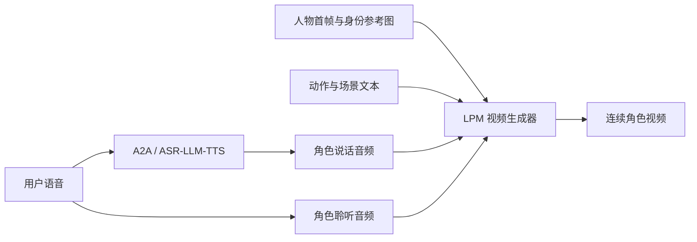
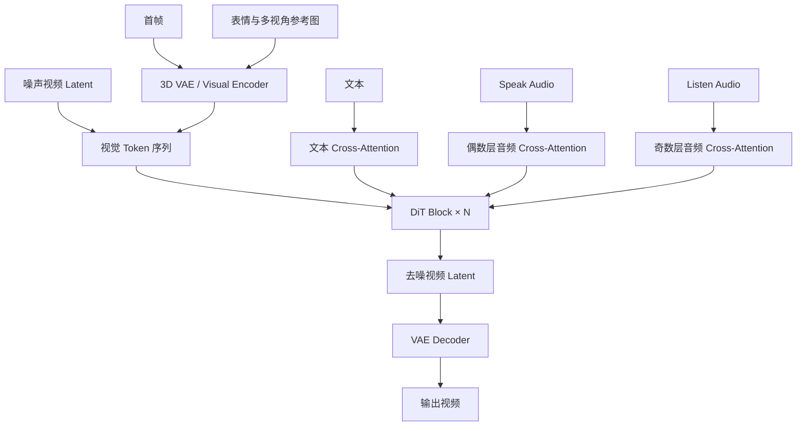
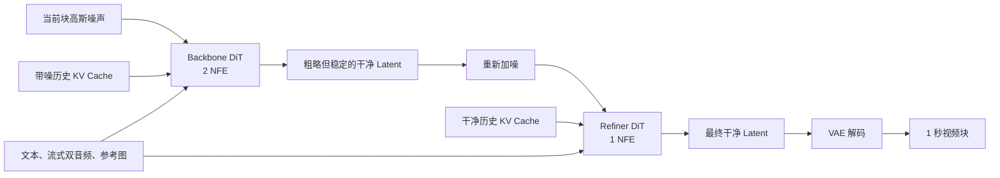

# LPM 1.0 模型结构与推理加速：如何把 17B 视频 DiT 变成实时“数字演员”

> 论文：[LPM 1.0: Video-based Character Performance Model](https://arxiv.org/abs/2604.07823)
>
> 项目主页：[Large Performance Model](https://large-performance-model.github.io)

## 一、LPM 1.0 想解决什么问题？

过去的数字人模型通常擅长“对口型”，却不一定擅长“表演”。

一个真正自然的对话角色，不仅要在说话时保持嘴型同步，还要在听别人说话时表现出注视、点头、犹豫、情绪变化和接话前的预备动作。与此同时，它还必须满足三个工程要求：

1. 表现力足够丰富，不能像循环播放的机器人；
2. 推理速度足够快，能够用于实时对话；
3. 生成时间足够长，人物身份、服装和场景不能逐渐漂移。

论文把这三者之间的矛盾称为“表演三难”：

```text
表现力  <---->  实时性  <---->  长时稳定性
```

LPM 1.0 的核心思路并不是用一个模型硬扛所有要求，而是构造一个两层体系：

- **Base LPM**：17B 双向视频 Diffusion Transformer，负责学习高质量、强控制能力的角色表演，是离线教师模型。
- **Online LPM**：从 Base LPM 蒸馏而来的因果流式模型，采用 Backbone + Refiner 两阶段结构，负责实时、无限时长的视频生成。

因此，理解 LPM 1.0 的关键是理解两件事：Base LPM 如何表示“表演”，以及 Online LPM 如何把昂贵的扩散生成变成实时流式生成。

---

## 二、系统全景：它不只是一个视频模型

从完整系统看，LPM 1.0 更接近一个“视觉表演引擎”：



其中：

- 用户语音直接作为角色的 **Listen Audio**，驱动点头、注视和情绪反应；
- 对话系统生成的角色语音作为 **Speak Audio**，驱动嘴型、说话表情和伴随动作；
- 文本负责描述动作、情绪、镜头和场景；
- 首帧及多张参考图负责固定人物身份。

需要注意，LPM 主要负责视觉生成。对话理解和语音合成可以由外部 Audio-to-Audio 模型，或者 ASR + LLM + TTS 系统完成。

---

## 三、Base LPM：17B 双向视频 DiT

### 3.1 从 14B 图生视频模型扩展而来

Base LPM 建立在一个 14B 预训练图生视频基础模型上，新增约 3B 参数的双音频 Cross-Attention 模块，最终形成 17B 模型。论文称它在超过 1.7 万亿多模态 Token 上训练。

它不是直接在像素空间生成视频，而是先通过 3D VAE 把视频压缩到连续 Latent 空间，再由 DiT 在 Latent 空间完成扩散去噪。

模型接收六类输入：

| 输入 | 作用 |
|---|---|
| 噪声视频 Latent | 扩散生成的起点 |
| 扩散时间步 | 表示当前噪声强度 |
| 首帧 | 确定初始画面和人物状态 |
| 多张身份参考图 | 保持面部、服装、身体和表情特征 |
| 文本 | 控制动作、情绪、镜头和场景 |
| Speak / Listen Audio | 分别控制说话行为和聆听反应 |

整体数据流如下：



### 3.2 一个 DiT Block 内部发生了什么？

每个 DiT Block 包含三个阶段：

```text
视觉 Self-Attention
        ↓
文本与音频 Cross-Attention
        ↓
FFN + AdaLN
```

第一阶段负责视频内部的时空建模。噪声视频 Token、首帧 Token 和多参考图 Token 被放进同一个 Self-Attention 序列，因此当前视频内容可以直接读取参考图中的脸部结构、牙齿、发型、衣服和身体比例。

第二阶段注入文本和音频控制。文本使用全局 Cross-Attention；说话音频与聆听音频则通过交错的音频 Cross-Attention 注入。

第三阶段通过 FFN 继续变换特征，AdaLN 则让网络根据扩散时间步调整不同去噪阶段的计算。

---

## 四、核心设计一：Speak / Listen 双音频交错注入

LPM 1.0 与普通音频驱动数字人的最大区别，是它显式建模了两条同时存在的音频流。

### 4.1 两条音频代表两种不同的运动分布

Speak Audio 主要驱动：

- 嘴唇和下颌运动；
- 说话节奏；
- 局部高频面部变化；
- 与语音节奏一致的头部和身体动作。

Listen Audio 主要驱动：

- 点头；
- 视线与眼神交流；
- 姿态变化；
- 理解、疑惑、认同等情绪微表情。

说话动作通常频率较高，并要求逐帧同步；聆听反应更加缓慢，而且常常依赖几秒钟的语义上下文。如果把两路音频不加区分地注入每一层，模型既要付出双倍音频注意力开销，也容易让两类行为的训练梯度相互干扰。

### 4.2 偶数层听 Speak，奇数层听 Listen

LPM 采用交错注入：

```text
第 0 层：Speak Audio
第 1 层：Listen Audio
第 2 层：Speak Audio
第 3 层：Listen Audio
...
```

视频 Token 产生 Query，当前层对应的音频特征产生 Key 和 Value：

\[
Q=\operatorname{RMSNorm}(W_qh)
\]

\[
\text{偶数层：}\quad K_s=W_k^{spk}c_{speak},\qquad V_s=W_v^{spk}c_{speak}
\]

\[
\text{奇数层：}\quad K_l=W_k^{lis}c_{listen},\qquad V_l=W_v^{lis}c_{listen}
\]

Speak 与 Listen 分支拥有独立的 K、V 和输出投影参数。文本注意力和音频注意力也使用不同输出投影，再将结果相加：

\[
\operatorname{out}
=W_o^{txt}A_{text}+W_o^{aud}A_{audio}
\]

这相当于让相邻 Transformer 层逐渐形成隐式的“说话动作专家”和“聆听反应专家”。

由于每条音频只进入一半的 Transformer 层，相比在所有层同时注入两路音频，论文称音频 Cross-Attention 的参数量和对应 FLOPs 可以减少约 50%。

### 4.3 两条音频采用不同的时间窗口

Speak Audio 使用较小的局部时间窗口，让每个视频 Token 只关注时间上邻近的音频片段，以获得精确嘴型同步。

Listen Audio 使用更大的窗口，因为点头、注视和表情反应往往不是由某一个音素触发，而是由更长时间范围内的语义触发。

这说明 LPM 并不是简单地增加一条音频输入，而是在注意力范围上也显式区分了“同步动作”和“理解后的反应”。

---

## 五、核心设计二：把多参考图当作长期身份 Token

单张正面照通常无法告诉模型人物侧脸、牙齿、背面服装和不同表情下的细节。LPM 因此使用两类参考图：

- 1～8 张表情参考图；
- 1～4 张身体视角参考图。

这些图片与视频帧通过同一个 3D VAE 编码到统一视觉 Latent 空间，然后直接拼到视频 Token 序列后面：

```text
[视频 Token]
[表情参考 Token]
[正面身体 Token]
[侧面身体 Token]
[背面身体 Token]
```

所有 Token 共同参与 Self-Attention，而不是为身份图片增加一条单独的 Cross-Attention 分支。这带来两个结果：

1. 视频和参考图可以在最细粒度的视觉特征上双向交互；
2. 身份条件不需要额外的专用注意力参数。

为了区分不同参考图，模型为表情类型、身体视角和每张子参考图分配不同的 3D RoPE 时间偏移：

\[
\operatorname{RoPE}_{ij}
=\operatorname{RoPE}(t+o_i+so_j,h,w)
\]

参考 Token 会在整个去噪过程和滑动窗口生成中持续存在，相当于不会被遗忘的“身份锚点”。表情参考图主要保存个性化的笑容、牙齿和微表情；身体视角图则主要保证人物转身时的几何结构、服装和背面细节。

---

## 六、从 Base LPM 到 Online LPM

Base LPM 是双向模型，可以利用完整上下文，质量高，但不适合实时互动：

- 未来音频和文本在在线场景中不可见；
- 常规扩散需要大量去噪步骤；
- 自回归生成时，模型必须不断使用自己生成的历史，误差会逐步累积；
- 如果持续关注全部历史，计算量和显存会随会话长度不断增长。

Online LPM 的目标不是简单地把 Base LPM 换成因果 Mask，而是同时解决少步生成、误差累积和长时缓存三个问题。

### 6.1 Base LPM 如何生成长视频？

Base LPM 的训练视频只有约 3～8 秒，但推理时可以通过重叠分块继续生成：

1. 新视频块使用上一块尾部的 Latent 作为初始化；
2. 相邻块保留重叠区域；
3. 在重叠区域进行线性融合，减少块边界跳变；
4. 每个块使用独立的文本提示描述当前动作、表情和场景变化。

论文报告，这种方式可以生成约 10 分钟且没有明显质量退化的视频。但是它仍属于离线延长：系统预先准备音频和分块文本，也不要求立即响应新输入，因此与真正的因果流式生成不同。

### 6.2 Backbone + Refiner

Online LPM 把生成任务拆成两个阶段：



Backbone 是“轨迹稳定器”：

- 使用两次网络前向，也就是 2 NFE；
- 从高斯噪声生成粗略干净的视频 Latent；
- 负责动作轨迹、时间连续性和长期稳定性；
- 使用带噪历史 KV Cache，使训练条件更接近真实部署中的不完美历史。

Refiner 是“细节恢复器”：

- 使用一次网络前向，也就是 1 NFE；
- 接收重新加噪后的 Backbone 输出；
- 恢复脸部、纹理、外观和高频动作细节；
- 使用干净历史 KV Cache，为细节重建提供更准确的上下文。

Backbone 先生成干净结果，为什么还要重新加噪？

因为这把一个困难任务拆成了两个相对简单的任务：Backbone 不必同时追求稳定轨迹和最锐利的画面；Refiner 也不必重新决定整个动作，只需要在一个固定噪声等级下修复真实运行中产生的残余伪影。

### 6.3 分块因果注意力

Base LPM 使用双向注意力，而 Online LPM 将视频序列切分成时间块。当前块中的 Token 只能关注：

- 当前视频块；
- 有限数量的历史视频块；
- 持久存在的参考图 Latent Token。

它不能访问未来块，因此可以随着音频和文本到达而实时生成。

### 6.4 四阶段蒸馏

Online LPM 不是一次性从教师模型蒸馏出来的。论文使用四阶段训练课程：

1. **ODE 监督初始化**：用教师模型的去噪轨迹训练 2-NFE Backbone，先让学生学会基本去噪。
2. **Off-policy DMD**：在教师产生的 Latent 状态上做分布匹配，并加入 LPIPS 约束抑制模式坍塌。
3. **On-policy DMD**：让 Backbone 在自己的自回归生成历史上训练，显式学习如何从自身误差中恢复。
4. **Refiner DMD**：对 Backbone 的真实输出重新加噪，再训练 1-NFE Refiner 修复残余伪影和高频细节。

第三阶段尤其关键。部署时，模型看到的历史不是教师生成的“完美历史”，而是自己刚刚生成的结果。On-policy DMD 将训练分布切换到学生自己的 Rollout 分布，降低长时间运行中的训练—推理偏差。

---

## 七、推理加速方法

LPM 的实时能力不是来自某一个技巧，而是算法、缓存、并行、Kernel 和调度的组合。

### 7.1 少步蒸馏：从多步扩散降到 2 + 1 NFE

传统视频扩散模型往往需要进行多次迭代去噪。Online LPM 将主干蒸馏成 2-NFE Backbone，再增加一个 1-NFE Refiner。

一次 1 秒视频块只需要三次 DiT 网络计算：

```text
Backbone 第一步
      ↓
Backbone 第二步
      ↓
Refiner 一步
```

这是最重要的算法级加速。没有少步蒸馏，后面的缓存、流水线和 Kernel 优化都很难把 17B 视频 DiT 推到实时范围。

### 7.2 流式音频窗口：固定编码成本

在线音频编码器不会反复编码整个对话历史，而是每次处理一个 3 秒窗口：

```text
[过去 2 秒音频] + [当前 1 秒音频]
```

窗口以 1 秒为步长向前滑动。重叠的 2 秒历史负责减少边界不连续，当前 1 秒则限制新增延迟。论文还使用 60 万条流式格式样本对音频条件进行微调。

文本控制更新频率较低，论文没有发现必须为流式文本额外微调，因此在线运行时只需增量更新文本指令。

### 7.3 滑动窗口注意力：让复杂度与会话长度解耦

模型不会让当前块关注整个生成历史，而只保留固定大小的上下文。论文的系统配置使用：

- 3 个固定 Sink Chunk；
- 2 个滑动窗口 Chunk；
- 参考图 Token 始终保留。

这样，无论会话持续一分钟还是一小时，每个新视频块处理的上下文规模基本不变，单步显存和计算开销不会随视频长度线性增长。

Sink Token 是长期保留的注意力锚点，可以减少窗口移动时的注意力突变、时间抖动和外观漂移。滑动窗口则负责保存最近动作所需的局部连续性。

### 7.4 Pre-RoPE KV Cache：缓存内容，动态更新位置

普通 KV Cache 往往保存已经应用 RoPE 的 Key/Value。但在滑动窗口中，同一个历史 Token 在新窗口里的相对位置会不断变化。如果直接缓存 RoPE 之后的结果，位置编码会过期。

LPM 的做法是：

1. 缓存应用 RoPE 之前的历史 K/V；
2. 新窗口到来时，根据 Token 在当前窗口中的新位置动态应用 RoPE；
3. 不重新计算历史 Transformer 激活。

它同时解决了两个问题：

- 避免对完整历史重复执行 DiT；
- 保持窗口移动后的相对位置一致性。

### 7.5 Generator–Refiner–VAE 流水线

系统把自回归生成切成固定的 1 秒块，每块为 24 帧，并划分为三个执行阶段：

```text
Generator → Refiner → VAE
```

不同视频块可以同时占据不同阶段：

```text
时间 →

Generator: [块 1] [块 2] [块 3] [块 4]
Refiner:          [块 1] [块 2] [块 3]
VAE:                     [块 1] [块 2]
```

当 Refiner 正在处理第 \(n\) 块时，Generator 可以同时生成第 \(n+1\) 块。文本/音频编码器还与 VAE 共享执行资源，以提高硬件利用率。

这里要区分两个指标：

- **首块延迟**接近多个阶段延迟之和；
- **稳态吞吐**主要由最慢流水线阶段决定。

因此，流水线并行主要提高持续生成吞吐，并不意味着第一块视频可以瞬间完成。

### 7.6 编译、融合 Kernel 与高效注意力

论文将两套 17B 级 DiT 视为主要计算瓶颈，并使用以下优化：

- `torch.compile` 编译整个执行图；
- 融合 Kernel，减少中间 Tensor 写回显存；
- FlashAttention-4 等高效注意力实现；
- 使用 Triton 实现和融合 RMSNorm、激活函数与 RoPE；
- 使用 FlexAttention + `torch.compile` 编译块稀疏因果 Mask；
- 不显式构造完整的 \(N\times N\) Attention Mask。

论文报告，经过这些优化，单 GPU 上一次 1-NFE、1 秒视频块的 DiT 计算约为 0.35 秒。

论文另外在流水线章节报告 Generator 和 Refiner 阶段各约 700 ms、VAE 约 180 ms。2-NFE Generator 的 700 ms 与“单次 NFE 约 350 ms”可以对应起来；但 1-NFE Refiner 与 700 ms 并非完全相同口径，论文没有进一步解释。因此这些数字更适合用来理解量级，不应直接相加后当作严格的端到端延迟。

### 7.7 交互系统调度

实时数字人不仅要持续生成，还要能处理用户突然说话、打断以及角色从聆听切换到说话。LPM Runtime 做了三项系统级优化：

1. **状态拆分**：把持续存在的视觉状态与可以刷新的音频/文本条件缓存分离。更新对话输入时，不破坏人物视觉连续性。
2. **块边界更新**：一个视频块使用固定条件完成，新条件只从下一块开始生效，避免半个块使用旧音频、半个块使用新音频。
3. **受控前瞻**：生成进度只略微领先播放进度，避免预生成过多视频。用户打断时，系统不需要丢弃很长的积压内容。

音频表示在提交前还会与当前活动视频块的时间轴对齐，从而保证语音、嘴型和身体动作保持同步。

---

## 八、一次在线请求是如何流过系统的？

以用户对数字人说话为例：

1. 用户语音进入系统，同时成为角色的 Listen Audio。
2. 流式音频编码器读取“过去 2 秒 + 当前 1 秒”的重叠窗口。
3. 当前视频块从高斯噪声开始生成。
4. Backbone 使用流式条件、参考图和带噪历史 KV Cache，执行两次 DiT 前向，得到稳定的粗略视频 Latent。
5. 粗略 Latent 被重新加噪。
6. Refiner 使用干净历史 KV Cache，执行一次 DiT 前向，恢复面部和纹理细节。
7. VAE 将最终 Latent 解码成 24 帧视频。
8. 当前块播放时，下一块已经进入 Generator。
9. 对话系统产生角色回答后，Speak Audio 在下一个块边界生效，角色从聆听状态平滑切换到说话状态。
10. 固定 Sink Token、滑动窗口历史和身份参考 Token 持续保留，使人物能够长时间稳定生成。

---

## 九、如何理解 LPM 的加速设计？

可以把整套方案对应到不同瓶颈：

| 瓶颈 | 解决方法 | 主要收益 |
|---|---|---|
| 扩散步骤过多 | 2-NFE Backbone + 1-NFE Refiner | 大幅减少 DiT 前向次数 |
| 自回归误差累积 | On-policy DMD、带噪历史训练 | 提高长时 Rollout 稳定性 |
| 历史越来越长 | 固定滑动窗口 + Sink Token | 计算和显存保持有界 |
| 历史激活重复计算 | Pre-RoPE KV Cache | 复用历史 K/V |
| 阶段串行导致 GPU 空闲 | Generator–Refiner–VAE 流水线 | 提高稳态吞吐 |
| Attention 与归一化访存昂贵 | FlashAttention、Triton 融合、`torch.compile` | 降低 Kernel 和 HBM 开销 |
| 用户打断造成大量废帧 | 块边界更新 + 受控前瞻 | 降低交互响应延迟 |

最重要的认识是：**少步蒸馏解决“算得太多”，KV Cache 解决“历史重复算”，流水线解决“硬件等着算”，状态调度解决“算出来却来不及响应”。**

---

## 十、代价与局限

LPM 1.0 并没有彻底解决数字人的所有问题。

首先，Online LPM 的实时性依赖完整系统协同，而不是仅靠一个轻量模型。Backbone 和 Refiner 都是大型 DiT，仍需要高性能 GPU、编译优化和流水线执行。

其次，少步蒸馏会重新分配模型质量。论文评测显示，Online LPM 在说话和长时对话场景中具有较好的稳定性，但在纯聆听场景里，一些微弱、低幅度的反应动作会受到时间正则化的抑制，表现弱于 Base LPM。

第三，当前系统主要面向单人、相对正对镜头的角色。它还不能很好地处理：

- 多人之间的注视与轮次协调；
- 长期对话记忆和人格持续性；
- 动态环境中的物体交互；
- 任意视角下的强 3D 一致性；
- 复杂叙事和物理世界约束。

最后，LPM 是视觉表演引擎，不是完整的端到端智能体。角色“说什么”仍通常由外部对话系统决定，LPM 负责把说话、聆听和情绪状态表现为连续视频。

论文所说的“无限时长”也更准确地表示：借助固定窗口和有界缓存，单步计算成本不会随着会话长度增长，系统可以持续 Rollout；它不等于对任意长时间都给出严格的质量保证。

---

## 十一、总结

LPM 1.0 的价值不只是做出了一个更清晰的 Talking Head，而是把实时数字人重新定义成一个“表演建模”问题。

在模型结构上，它通过：

- 17B 视频 DiT；
- Speak / Listen 双音频交错注意力；
- 多参考图 Self-Attention；
- 分段 3D RoPE 身份编码；

统一建模角色说话、聆听、表情、动作和身份。

在实时推理上，它通过：

- 2-NFE Backbone + 1-NFE Refiner；
- On-policy DMD；
- 分块因果注意力；
- Pre-RoPE KV Cache；
- Sink Token + 滑动窗口；
- Generator–Refiner–VAE 流水线；
- FlashAttention、Triton 和 `torch.compile`；
- 状态拆分与块边界调度；

把一个昂贵的双向视频扩散教师模型转化为可持续运行的流式系统。

这篇论文最值得借鉴的地方，是它没有把“实时”理解为单纯压缩模型，而是把实时生成看作模型结构、蒸馏分布、缓存策略、Kernel 实现和交互调度共同决定的系统问题。

---

> 封面图基于 Cristiano Ronaldo 在 2017 年联合会杯新西兰对阵葡萄牙比赛期间的照片制作。摄影：Kirill Venediktov；原图来源：[Wikimedia Commons](<https://commons.wikimedia.org/wiki/File:New_Zealand-Portugal_(13).jpg>)；许可：[CC BY-SA 3.0](https://creativecommons.org/licenses/by-sa/3.0/)。博客封面在保留人物主体的基础上使用生成式填充横向扩展为 2:1，并由 Astro 缩放、转换为 WebP；衍生图继续采用 CC BY-SA 3.0。
