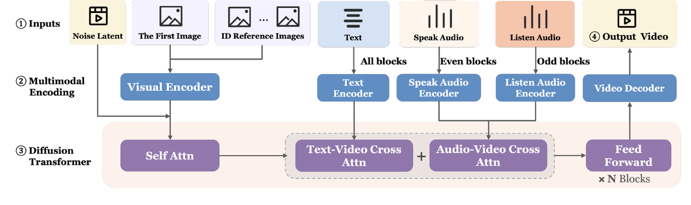
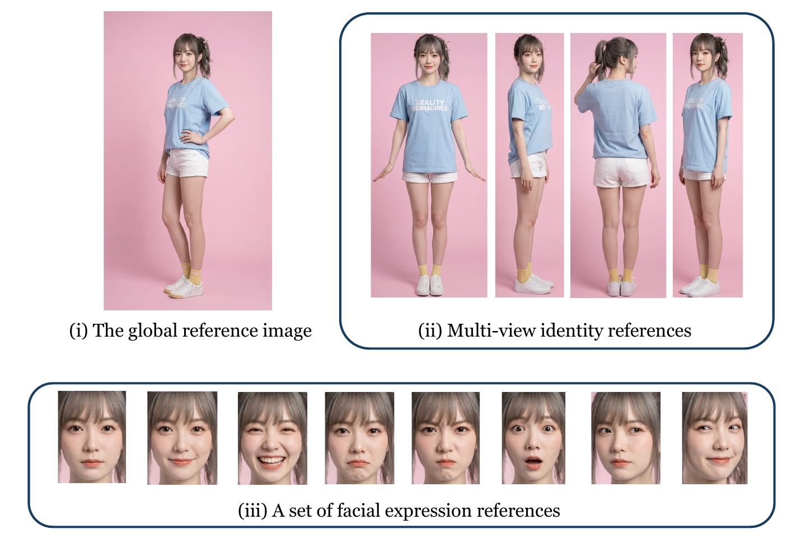
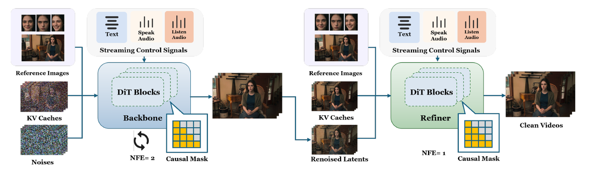
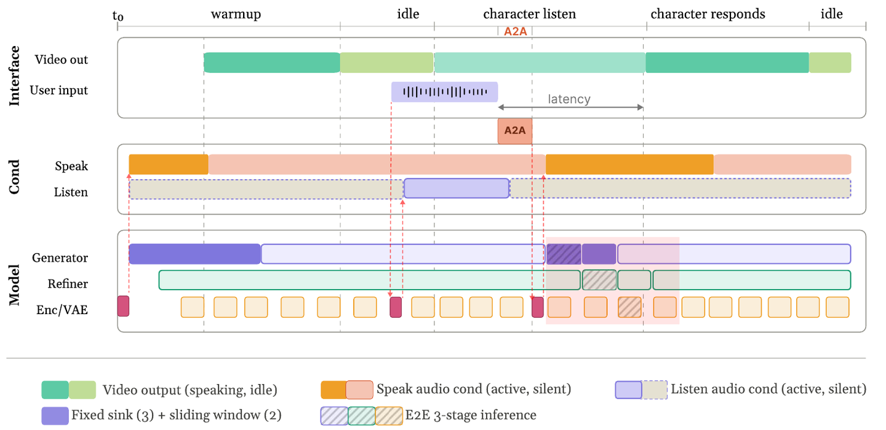

这篇文章讨论的是：类似 Qwen3-Omni 以及一系列 Omni 和 LPM 1.0 这种支持实时流式输出的模型，传统的多模态输出（如图片生成、视频生成模型等）并不在考虑之中。


过去几年，LLM Serving 的主线已经比较清楚：Continuous Batching 解决批处理吞吐，PD 分离把 prefill 和 decode 拆开调度，后面还有 AF 分离、KV 迁移、prefix cache、算子融合、稀疏注意力和线性注意力适配。这些工作很重要，但它们大多还是围绕一个核心目标展开：在尽可能高的 GPU 利用率下，把更多 request 跑完。

实时流式推理的约束更硬。以 TTS 或实时 Omni 对话为例，系统要先保证 RTF 小于 1，让用户听到或看到的输出不断流，然后再谈并发、吞吐和成本。它关心的是长时间存活的 session，而不是一次请求的完成时间。

到了视频输出场景，session 里会持续出现音频、视频帧、文本指令和外部事件，输出侧也会持续产生语音、表情、动作和画面。推理系统需要把这些输入输出放到同一条时间线上处理，明确状态生效、结果提交、缓存保留和用户打断后的丢弃边界。

这也是为什么实时视频推理不能只被理解成“更快的 LLM Serving”。它更像是一个 session runtime：既要持续接收输入，也要持续产出结果；既要让单个用户不掉实时性，也要在多用户并发下保持公平；既要管理 KV cache，也要处理更高层的 memory、角色状态和播放进度。

下面先从 LPM 1.0 开始。LPM 是米哈游推出的实时数字人交互模型，强调强实时性、长时稳定和全模态输入输出。这里更关注它为了在线交互，怎样组织推理侧的状态、缓存、调度和多模态控制。


## 模型音频输出

LPM 在音频交错上做了一些很有巧思的设计。比如在音频的输入上，它做了双音频的交错输入，这样可以保证我们有两个不同的控制流，来对模型进行更好的输入控制。LPM 把这两路音频在 `cross-attention` 里交错注入：

偶数层处理 `speaking audio` 奇数层处理 `listening audio`

它们分别的作用是：

`speaking audio`：角色自己说话时的音频，驱动口型、面部、发声
`listening audio`：对方说话时的音频，驱动点头、目光接触、微表情、插话前的停顿。



图源：LPM 1.0 技术报告 Figure 5（arXiv:2604.07823）。这里可以看到，`speaking audio` 和 `listening audio` 不是简单拼到输入里，而是分别经过 audio encoder，并在 DiT block 里通过 `Audio-Video Cross Attention` 注入。

这个地方可以看到它和一些现有的 Omni 架构的不同。

现有的很多 Omni 模型其实只是包含了音频的输入（即用户的输入），但并没有关注模型本身的输出。其实对于模型或者数字人来说，它本身的输出（音频或者视频）也是一个值得考量的点。

我们必须要把整个模型输出的过程连贯起来，从而保证长上下文的一致性，而不仅仅是轮次性的对话。我个人觉得轮次性的对话可能并不是未来，或者说轮次性的对话并不能承载所有的信息。

让我们简单举个例子。比如你希望有一个实时的音频助手，它的形象能和你进行实时对话。你不希望它的表情只是单纯有几个预设的状态，而是希望它能根据整体的对话上下文（包括它的对话内容和音频输出），实时地对唇形或整体面部表情做出变化。同时，它说话的语气也会根据上下文进行调整。

这部分显然要根据它的输出逻辑来驱动。它在多轮对话中的整体输出，会影响到后续对话的表现。但目前的 Omni 模型们，很多其实并没有做到这一点。


## 当前KV Cache的不足

对于 LPM 来说，它在 KV cache 设计也有一些亮点：

它包含了一些“锚点”（Anchor/Sink），用于记录一些不会被驱逐的 KV cache。比方说，它会保留这些参考图，从而保证整体的人物生成形象是稳定的，即使是在长流式视频的情况下。




图源：LPM 1.0 技术报告 Figure 4（arXiv:2604.07823）。这张图能说明 LPM 里的 reference 不是单张脸图，而是一组多粒度身份锚点：全局外观、多视角身体参考和表情参考共同约束长时间生成中的身份一致性。

这个地方其实可以进一步展开。LPM 的 KV cache 不是简单地“保留最近的历史”，而是把不同历史状态做了语义区分。对于一个长时间存活的数字人 session 来说，历史里至少有两类东西：一类是长期稳定锚点，比如参考图、多参考身份 token、`sink token`；另一类是最近几秒的精确历史，比如角色刚刚的头部姿态、嘴型、手部动作和表情过渡。

如果我们用普通 LRU 或 FIFO 来管理这些 KV cache，那么系统只知道“哪个 block 最近用过”，但不知道“这个 block 代表什么”。这样在长时间流式生成中，就可能把参考图、身份锚点、sink token 和普通历史一起淘汰掉。对于一个传统的大模型来说，这可能并不是缺点，甚至还有可能是优点。因为在某些情况下，末端的注意力确实值得分配更高的权重，毕竟当前任务肯定是最重要的。但在实时流式的场景下，很多历史信息也同样值得关注。或者说，一些信息应该成为“不变量”，需要你每次都通过类似于 System Prompt 的方式来进行干预。

所以 LPM 这里实际是把三件事组合在一起看：

```text
Anchor / Sink       保留长期稳定状态
Sliding Window      保留最近精确历史
Pre-RoPE KV Cache   保证窗口滑动后 KV 还能正确复用
```

其中 `Anchor/Sink` 解决的是长期稳定性问题。参考图 token 和 `sink token` 应该被 pin 在 session 里，作为长期身份和时序稳定的锚点，避免角色在长时间生成后逐渐偏离原始形象。

`Sliding Window` 解决的是局部连续性问题。视频生成不能只靠 anchor，因为动作、表情和嘴型的自然过渡依赖最近几秒的精确状态。比如上一秒角色正在点头、转头、抬手，下一秒就要自然延续这个动作。因此 LPM 会保留一个固定长度的 recent window，而不是保留全部历史。

`Pre-RoPE KV Cache` 解决的是另一个更底层的问题：窗口在滑动时，历史 token 在当前窗口里的相对位置会变化。如果缓存的是 RoPE 之后的 K/V，那么位置信息已经被写进 KV 里，窗口一移动，旧 KV 的位置语义就不一定对了。LPM 选择缓存 RoPE 之前的 K/V，在每个新窗口里根据新的相对位置动态 apply RoPE。这样既避免重算历史 transformer activation，又能保持位置编码一致。

可以把它理解成下面这个窗口滚动过程：

```text
生成 chunk N 时:
  anchor/sink + [chunk N-2, chunk N-1] + [chunk N]

生成 chunk N+1 时:
  anchor/sink + [chunk N-1, chunk N] + [chunk N+1]
```

在这个过程中，anchor/sink 不动，recent window 向前滑动，最老的 recent chunk 被淘汰，新的 chunk 写入 recent cache。而保留下来的历史 KV 需要在新的窗口位置下重新应用 RoPE。

这对现有推理系统的启发是：KV cache manager 不能只提供 request 级复用和普通 LRU 驱逐。对于流式实时视频生成，它至少需要引入几类更明确的 cache 语义：

- `cache_class`：区分 anchor、recent、current、long-term 等不同状态。anchor 用于身份和长期稳定，recent 用于最近动作连续，current 对应正在生成的 chunk，long-term 可以进入压缩或迁移。
- `eviction_policy`：区分 pinned、sliding、compress、offload 等不同淘汰策略。anchor 默认 pinned，recent 按窗口滑动，long-term 可以压缩或 offload。
- `position_policy`：区分 pre-RoPE 和 post-RoPE。对滑窗视频生成来说，pre-RoPE 更适合长期复用，因为它允许窗口移动后重新应用位置编码。

结合现在的 vLLM 或 SGLang 来看，它们已经有很强的 KV cache 基础能力，但方向不完全一样。

vLLM 的重点是 block 级 KV 管理。PagedAttention 把 KV 拆成 block，prefix caching 通过 block hash 复用已经算过的前缀；当 block 不再被请求引用时，会进入 free queue，后续可以被重新分配或从 prefix cache 里淘汰。这个设计很适合高吞吐 LLM serving，因为它把显存分配、prefix reuse 和调度绑定得很紧。

SGLang 的重点是 prefix 结构化复用。RadixCache 用 radix tree 管理 prefix，支持 LRU、LFU、priority、SLRU 等驱逐策略；HiCache 进一步把 KV 扩展到 GPU、host 和外部存储之间。它也有 `SessionAwareCache` 这类机制，可以在 streaming session 之间保留和恢复一部分 KV 状态。

对 vLLM / SGLang 这类通用框架来说，底层 KV manager 不一定要理解这些状态的业务语义。更合理的分层是：模型和 orchestrator 决定哪些状态应该长期保留、滑窗更新、延迟提交或打断丢弃；推理框架提供足够细的 cache primitive 来执行这些 policy。

从现有代码看，vLLM 已经有 block 级分配、prefix cache、ref count 和 sliding-window 释放，但缺少面向 session/chunk 的 pin、commit 和 discard 接口。SGLang 更进一步，RadixCache 支持多种驱逐策略，SessionAwareCache 支持 streaming session 复用，HiCache 也有 prefix pin；但这些能力仍主要围绕 prefix/session 复用，还没有形成 LPM 这类基于 Causal 所需的 chunk-level lifecycle control。对于实时流式推理，下一步更关键的是把这些底层能力组织成可被 runtime 调用的 policy 接口。

看 vLLM v1 的实现，它已经有几块很有用的基础。`Request` 里维护 `block_hashes`，`KVCacheManager.get_computed_blocks()` 会用这些 hash 找最长 prefix cache hit；命中后，`BlockPool.touch()` 增加 block 的 `ref_cnt`，把正在复用的 block 从可驱逐队列里移走。新 block 则通过 `BlockPool.get_new_blocks()` 从 `FreeKVCacheBlockQueue` 取出。到了 `KVCacheManager.allocate_slots()`，它还能处理 `num_new_computed_tokens`、`num_external_computed_tokens`、`num_lookahead_tokens` 和 `delay_cache_blocks`，并且先调用 `remove_skipped_blocks()` 释放滑窗外不再参与 attention 的 block。最后真正写入 prefix cache 时，它只缓存 finalized tokens，避免把 draft token 写进稳定 cache。

这个细节放到实时视频里很关键。过去那种 YOLO 式做法，很容易把“刚算出来的中间结果”直接塞进后续状态里；但视频 chunk 可能被打断，epoch 可能过期，Refiner/VAE 之前的结果也未必应该进入稳定历史。写早了，旧状态会污染后面的生成；完全不写，又会丢掉可以复用的计算。更合理的做法是让当前 chunk 先处在 pending 状态，等它真的被提交后，再写入 recent window 或 clean cache。

所以这里缺的不是让 vLLM 的 block manager 理解 `anchor`、`recent`、`current` 这些业务含义。更合适的分层是：runtime 用 `session_id`、`chunk_id`、`epoch`、`stage_id` 管住一组 block 的生命周期，底层提供 `pin`、`commit`、`discard`、`slide` 这类动作。vLLM 现在已经有 ref count、prefix reuse、sliding-window release 和 delayed cache 的底座，但还没有把它们包装成实时视频 runtime 可以直接调用的 chunk-level 接口。

LPM 的 cache 设计重点不是缓存更多内容，而是在显存固定的情况下明确区分哪些状态必须长期保留，哪些状态只需要保留最近窗口，哪些状态可以压缩或迁移。这个分层是长流式视频里同时维持身份稳定、动作连续和固定推理成本的关键。



图源：LPM 1.0 技术报告 Figure 6（arXiv:2604.07823）。这张图把 online 路径画得更直接：Backbone 读取 `noisy-history KV cache` 做长期 rollout 稳定，Refiner 读取 `clean-history KV cache` 恢复最终细节，两段都在 `chunk-wise causal mask` 下运行。


## 播放时间线与Controlled Lookahead

在 KV cache 之外，另一个非常值得关注的点是调度。传统 LLM Serving 里的 scheduler，更多是在考虑怎么把请求拼成更大的 batch，怎么让 prefill 和 decode 尽量吃满 GPU。但在流式视频或者实时数字人里，scheduler 不能只看 GPU 利用率，它还必须看播放时间线、网络抖动、端侧播放缓冲和多用户之间的实时性均衡。
这里有一个很核心的关系：

```text
generation cursor  模型已经生成到哪里
playback cursor    用户已经播放到哪里
```

如果 generation cursor 领先 playback cursor 太少，用户端就容易卡顿。这个卡顿不一定只来自模型算得慢，也可能来自网络 jitter、端侧解码、WebSocket 发送拥塞、音视频同步等待等因素。如果领先太多，系统看起来吞吐更高，但用户一旦打断，提前生成的那些 chunk 都会变成需要丢弃的积压内容。对实时交互来说，这部分积压不是收益，而是延迟债。

所以 LPM 里提到的 Controlled Lookahead 很关键。它不是单纯让模型一直往前跑，而是让 generation cursor 只比 playback cursor 稍微超前一点：

```text
generation_cursor - playback_cursor <= lookahead_budget
```

这个 `lookahead_budget` 可以理解成一个安全缓冲。它既要保证播放端不断流，也要避免模型生成得太远。这个思想和 RTC 里的 Jitter Buffer 很像：RTC 不会把收到的音视频包立刻无脑播放，而是保留一个小缓冲，用来吸收网络抖动。但缓冲不能无限变大，否则端到端延迟会变差。实时生成系统里的 lookahead 也是类似逻辑，只不过缓冲的不是已经收到的网络包，而是模型提前生成好的视频 chunk。


## Pipeline Overlap与查询预计算

这也是 Stage 模式合理的地方。像 LPM 这样的系统有 Generator、Refiner、VAE，不少 Omni 模型也会有 Thinker、Talker、Code2Wav，实际业务里还可能外接检索、推荐、工具调用、动作规划等 stage。Stage 拆开以后，系统可以让不同 chunk 处在不同阶段里并行推进；但一旦遇到用户打断、条件更新、召回结果变化，stage 之间就不能只是简单串起来。每个 stage message 都需要带上 `chunk_id`、`epoch`、生效条件版本等信息，这样才能判断这个结果还要不要继续往下游传。



图源：LPM 1.0 技术报告 Figure 7（arXiv:2604.07823）。这张图的重点不是单个模型调用，而是把 Interface、Condition 和 Model 三层放在同一条时间线上：用户输入、`speaking/listening audio condition`、Generator/Refiner/VAE 三段执行，以及 `fixed sink + sliding window cache` 都要按 chunk 对齐。

顺着这张图看，还有一个容易被忽略的点：用户发起 query 之前，系统已经在持续接收视频帧、用户音频和 A2A 输出音频。这里面有不少计算可以提前完成，比如 vision/audio encoding、condition embedding，以及后续能复用的 prefill 状态。

Incremental Prefill 的核心，是让输入到达本身触发模型侧的增量计算。一个更理想的流程大概是这样：

```text
video.frame / audio.chunk 到达
  -> 过滤、切 chunk、对齐 timestamp
  -> vision/audio encoder 提前运行
  -> 结果写入 session-local prefill state 或 KV cache

video.query 到达
  -> 只追加 query text 和少量新条件
  -> 直接基于已经预计算好的上下文进入后续生成
```

这样做的收益很直接：用户说话、摄像头上行、A2A 返回音频的这段时间，不再只是输入等待时间，也可以变成模型准备上下文的时间。等 query 真正到达时，系统只需要追加新的文本问题和少量条件更新，然后基于已经预计算好的上下文继续往后生成。

对照 vLLM v1 来看，它的 scheduler 已经有一个很适合继续演进的抽象：调度器并不强行区分 prefill phase 和 decode phase，而是用 `request.num_computed_tokens` 表示这个 request 已经算到哪里。每一轮调度都会计算还差多少 token，再用 `long_prefill_token_threshold`、`enable_chunked_prefill` 和当前 token budget 决定本轮推进多少。这个机制已经能覆盖 chunked prefill、prefix cache hit、spec decode 和部分 KV connector 场景。

vLLM 现在也有 streaming request 的状态雏形。`RequestStatus` 里有 `WAITING_FOR_STREAMING_REQ`，`Request` 里有 `resumable` 和 `streaming_queue`；当新的 streaming update 到来时，scheduler 的 `_update_request_as_session()` 会把新的 `prompt_token_ids` 和 `mm_features` 接到原 request 后面，更新 `block_hashes`，再把状态切回 `WAITING`。这说明 vLLM 已经能表达“同一个逻辑请求继续追加输入并恢复调度”。

这里的问题在触发点。vLLM 现在的增量更多发生在 request 内部：prompt 已经形成，scheduler 按 token budget 继续推进这条请求。实时视频里，视频帧和音频 chunk 往往比用户 query 更早到达。如果等 query 来了再把这些媒体输入重新组装成一次请求，前面的等待时间就浪费掉了，query 路径上还要额外背 encoder 和 prefill 的成本。更自然的方式是：frame/audio chunk 到达时就先做 encode 和 condition embedding，结果挂在 session 的 pending state 上；query 或新的 text condition 到来时，只负责选择已经准备好的 chunk，并补上少量新条件。这样 Incremental Prefill 的触发点就从 `video.query` 前移到了输入流本身。


## 打断恢复与Boundary-Aligned Updates

打断场景也能看出差异。普通 request serving 里，用户取消请求通常就是 abort。但在 1 秒 chunk 的视频 pipeline 里，立刻取消所有已经排队或正在执行的工作不一定划算。更稳的做法是给 session 一个 `epoch` 或 `cancel_token`：用户打断后 `epoch + 1`，已经完成或即将完成的旧 chunk 可以在 stage 边界被丢弃，不再进入下一阶段，也不再提交给播放端。

```text
chunk N 正在生成:
  可能已经进入 Generator / Refiner / VAE 中的某个 stage

用户 interrupt:
  session epoch + 1

chunk N 的 stage 输出回来:
  如果 epoch 过期，丢弃
  如果 epoch 仍然有效，继续进入下一个 stage 或提交给播放端
```

这样做的好处是，系统可以减少不必要的后续计算和调度。例如旧 epoch 的 Generator 输出已经没有意义，就不必再送进 Refiner；旧 epoch 的 Refiner 输出也不必再送进 VAE。它不是要求把逻辑写进 GPU kernel 里，而是在 scheduler、stage queue 和 handoff message 上把边界处理清楚。

另一个和调度强相关的点是 Boundary-Aligned Updates。LPM 里明确说，新输入不是随时插进当前 chunk，而是在 chunk 边界生效，也就是 `chunk N` 用旧条件完成，`chunk N+1` 开始使用新条件。

这个设计会让响应稍微晚一点，但能避免同一个 chunk 前后条件不一致导致的嘴型、表情和动作断裂。对推理框架来说，输入更新和 interrupt 至少要带上明确的 `chunk_id` 或生效边界。


## 多Session下的实时公平调度

再回顾整个系统，这其实是一个很朴素的实时调度问题：单个 session 要有足够强的实时性，但整个服务也要在高并发下保持公平和稳定。不能为了一个 session 的低延迟，把其他 session 全部饿死；也不能为了整体吞吐，把某个正在交互的用户拖到明显卡顿。这里可以从 Linux 里 EEVDF 这类调度思想里借鉴一些东西。核心是把“什么时候必须产出下一个 chunk”变成 scheduler 能理解的 deadline，而不是只用 batch size 和 GPU occupancy 来做决策。

放回 vLLM 或 vLLM-Omni 这类框架里看，下一步需要补的不是简单多开一个 WebSocket endpoint，而是让调度器把每个实时连接拆成带 deadline 的 chunk 任务。比如同时进来 3 个实时 session，每个 session 都要求 RTF < 1，调度器看到的应该类似下面这样：

```text
当前时刻 t

Session A: 对话 avatar
  playback=12.7s, generation=13.0s, lookahead=0.3s
  A13: Generator -> Refiner -> VAE        deadline 很近，优先推进

Session B: 数字人直播
  playback=30.0s, generation=32.0s, lookahead=2.0s
  B32: Generator -> Refiner -> VAE        已经超前很多，暂时降低优先级

Session C: 游戏 NPC
  playback=5.2s, generation=6.0s, lookahead=0.8s
  C6: old epoch，用户刚打断              后续 stage 可以丢弃
  C7: new epoch，等待新条件              需要尽快接上

一个可能的调度顺序:
  [A13 Generator] [C7 Generator] [A13 Refiner] [C7 Refiner] [A13 VAE]
       ↑              ↑              ↑             ↑            ↑
    补 A 的实时性   接 C 的新输入   继续压 A 延迟   避免 C 断流   提交 A 给播放端

  B32 暂时不排，因为它已经超过 lookahead budget
  C6 不再进 Refiner/VAE，因为它属于过期 epoch
```

这时 scheduler 不能只看哪个 batch 更大、哪个请求更容易合并。它还要知道每个 session 下一段音频/视频 chunk 的播放截止时间、当前生成进度、是否已经超过 lookahead budget，以及这个 chunk 是否属于过期 epoch。真正的调度不是轮询（RR），而是根据不同 session 的状态做更均衡公平的 policy。


## 尾巴

从 LPM、实时 Avatar、Omni 音视频模型到更偏 world model 的流式生成，推理系统面对的是同一个变化：模型输出开始进入真实时间线。输入持续到来，输出持续播放，状态持续积累，用户随时可能打断。

这种强即时交互的需求也许是大多数普通用户所希望拥有的，因而这也把 serving 系统的核心对象从 request 转向 session。KV cache 要有生命周期，scheduler 要关注 deadline，pipeline stage 要带 chunk 和 epoch，预计算需要跟随输入流提前发生。单点优化仍然重要，但多模态流式推理似乎在很多情况下和传统推理并不一定可以复用同一套基础设施。
