# Sol Video Inference Engine：面向高效视频生成的智能体原生全栈加速框架

> **论文信息**
> - 英文题目：*Sol Video Inference Engine: Agent-Native Full-Stack Acceleration Framework for Efficient Video Generation*
> - 作者：Yitong Li、Junsong Chen、Haopeng Li、Haozhe Liu、Jincheng Yu、Ligeng Zhu、Ping Luo、Song Han、Enze Xie
> - 机构：NVIDIA Research，Efficient AI Team & Singapore Lab
> - 版本：[arXiv:2606.23743v2](https://arxiv.org/abs/2606.23743)，2026-06-24
> - 代码：[NVlabs/Sana - sol-engine](https://github.com/NVlabs/Sana/tree/sol-engine)
> - 项目主页：[Sol Video Inference Engine](https://nvlabs.github.io/Sana/Sol-Engine/)

## 摘要

现代视频扩散模型通过扩大规模来提高生成质量，但也显著增加了推理成本。虽然已有多种加速方法，一个核心难点在于：最有效的加速实现高度依赖具体实例（instance-specific）。对某个“模型、硬件、推理配置”组合有效的方案，往往无法直接迁移到另一个组合。

模型在架构、数值敏感性和注意力集中模式上各不相同；推理配置在空间/时间分辨率与视频时长上不同；硬件平台则具有不同的内存层级、数值格式支持和算子吞吐。这些因素共同形成了庞大的调优空间，使人工性能工程成本高昂。

为此，本文提出 **Sol Video Inference Engine**：一个面向视频扩散模型、无需训练（training-free）的智能体原生加速框架。它把跨步缓存、稀疏注意力、token 剪枝、量化和 kernel fusion 五类通用技术组织成智能体加速栈，针对具体部署实例优化。

对于给定的“模型、硬件、服务配置”，多个 skill agent 并行优化各项技术，agent integrator 将它们组合成全局加速栈，人类验证者则反馈生成质量。作者在 64B Cosmos3-Super、22B LTX-2.3 和 2B SANA-Video 上实例化该流程；在只需少量人工投入的情况下，全栈方案取得超过 2× 的端到端加速，同时保持近乎无损的 VBench 质量。

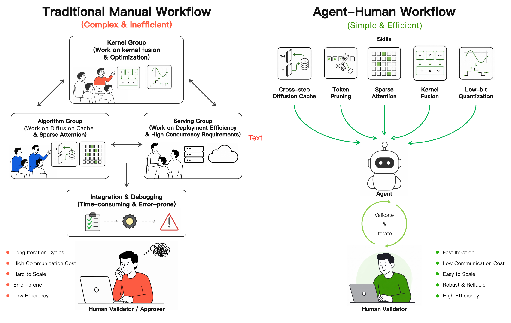

**图 1｜传统人工加速流程与 Sol Video Inference Engine 的 agent-human 流程。** 左：加速工作分散到多个掌握不同技术的人工团队，迭代周期长、沟通成本高，并需人工集成与调试。右：Sol 将加速技能暴露给 agent 系统，由其完成局部搜索与全栈集成；人类主要参与质量验证和迭代。这种协作模式降低了协调开销与人工投入，并使流程更快、更易扩展、更可靠。

---

## 1 引言

视频扩散模型正持续向更高生成质量、更长时长和更高保真度扩展，但这种扩展也提高了推理成本。现代视频扩散系统同时包含十亿级乃至更大规模的骨干网络、长时空序列以及多步采样，因此推理计算十分沉重。

尽管已有大量加速方法，加速这类系统并不是“一次优化、处处适用”的问题。有效加速高度依赖具体实例：对某个“模型、硬件、推理服务配置”组合最好的方案，换到另一个组合常常失效。不同模型的架构、数值敏感性和注意力集中模式不同；推理配置在空间/时间分辨率、视频时长、去噪调度和 batching 策略上不同；目标硬件也从高显存数据中心 GPU 到消费级边缘设备不等，各自支持的数值格式与吞吐差异明显。

因此，各类加速方法的具体实现也依赖部署实例：

- 某种 cache 策略可能适用于一种去噪调度，却在另一种调度下产生漂移。
- 某种稀疏模式可能在一个分辨率下保持质量，却在更长的时间上下文中失效。
- 一种低精度后端可能在某类硬件上具有良好的速度-质量权衡，但在另一类硬件上收益很差。

组合空间过大，使逐实例手工调优耗费大量工程资源。

Sol Video Inference Engine 用两个相互耦合的部分解决这一问题：

1. 覆盖跨步缓存、稀疏注意力、token 剪枝、量化和 kernel fusion 的全栈加速技术。
2. Agent-native 工作流：多个 skill agent 并行执行各技术的局部优化，agent integrator 通过全局搜索组合候选方案，人类验证者提供视觉质量反馈。

本文将该框架应用于 64B Cosmos3-Super、22B LTX-2.3 和 2B SANA-Video，以很少的人工投入得到有效的加速栈。

### 本文贡献

- **问题重述。** 系统分析视频扩散推理的加速空间，将加速表述为实例特定的调优问题，而非一次性的通用优化。
- **全栈加速框架。** 协同整合算法与系统层技术，包括跨步缓存、稀疏注意力、token 剪枝、量化和 kernel fusion。
- **Agent 驱动的优化工作流。** 提出编排并行 agent 与 integrator 的原生架构，用较少人工投入替代传统多团队部署工程，并自动给出高度优化的速度-质量配置。
- **广泛的实验验证。** 无需训练的框架在三种规模与架构差异明显的先进模型上均获得超过 2× 的端到端加速，且视觉质量基本不受影响。

### 报告结构

第 2 节回顾相关工作；第 3 节分析部署约束及视频扩散加速的实例特定性质；第 4 节介绍智能体加速框架、由局部到全局的流程和所用技术；第 5 节给出三个模型上的实验；第 6 节总结全文。

## 2 相关工作

### 2.1 视频扩散模型

当前视频生成主要由大规模 Diffusion Transformer（DiT）主导。CogVideo/CogVideoX [1,2]、Wan 系列 [3]、HunyuanVideo [4,5] 和 Cosmos3-Super [6] 等开源模型确立了高保真、物理感知合成的主流范式。

为处理更长时间上下文与更高分辨率，LongCat-Video [7]、LTX-2.3 [8]、JoyAI-Echo [9] 和 Pyramid Flow [10] 采用多阶段、自回归或记忆增强的生成管线。另一些模型从效率方向探索设计空间的极端，例如 SANA-Video [11] 优先采用线性注意力。

尽管架构多样，这些系统共享一个严重瓶颈：海量时空 token 与迭代去噪步骤叠加，使高效部署成为关键系统挑战。

### 2.2 视频生成加速

以往工作从三个互补层次降低视频扩散成本。

#### 算法层

Cache 方法利用相邻去噪步的相似性：

- TeaCache [12] 依据时间步间输出变化决定是否复用缓存残差。
- TaylorSeer [13] 用 Taylor 展开预测跨步特征，以减小激进复用带来的误差。
- 此外还有多种扩散 cache 策略 [14-16]。

#### 模型层

稀疏注意力与 token 缩减降低每个去噪步内部的工作量：

- PISA [17] 使用无需训练的分段稀疏注意力与一阶 Taylor 补偿。
- Sparse VideoGen 系列 [18,19] 利用时空稀疏性、在线 profiling 和 layout-aware 稀疏执行。
- VSA [20] 学习视频稀疏注意力算子。
- 其他工作也从不同角度研究了视频扩散的稀疏注意力 [21-26]。
- ToMe-SD、Astraea、TAPE 和 CoReDiT 通过合并、剪枝或重建冗余扩散 token 来降低计算量 [27-30]。

#### Kernel 层

通过量化与融合降低剩余算子的成本：

- PTQ4DiT、Q-DiT、ViDiT-Q 与 SVDQuant 研究面向扩散模型的低精度执行 [31-35]。
- CUTLASS epilogue、ByteTransformer 与 CODA 展示了如何将 GEMM 邻接的 memory-bound 操作融合为高吞吐 kernel [36-38]。

Sol Video Inference Engine 建立在这些技术族之上。

### 2.3 Agentic 工作流与 Harness Engineering

近期研究开始把 agent 周边运行时——工具访问、执行循环、验证、记忆与反馈——视作一等优化对象，而不再只是附属胶水。

AgentBench 与 MLAgentBench 提供交互环境和机器学习实验中的语言 agent 评测 [39,40]；SWE-agent、AutoCodeRover、Agentless 与 OpenHands 研究 agent 接口、搜索、定位、执行环境及通用开发 agent 对自主代码改进的影响 [41-44]。

AI Harness Engineering 将 harness 形式化为基础模型软件 agent 的运行时底座 [45]；The AI Scientist 展示了用 agent 系统串联创意生成、实验执行、制图与论文写作的端到端循环 [46]。

在系统优化方向，CUDA-LLM 和 CudaForge 借助编译检查、正确性验证、profiling 与硬件反馈自动生成或优化 CUDA kernel [47,48]。Sol 与这一方向一致，但目标不同：它协调多种视频扩散推理加速技能，形成受质量约束的全栈部署。

## 3 背景：推理冗余与部署异构性

### 3.1 视频扩散模型中的推理冗余

扩大视频扩散模型可以改善生成质量、时间一致性与可控性，也显著提高推理成本。Cosmos3-Super 扩展到 64B 参数，以支持高容量视频与物理感知内容生成 [6]；LTX-2.3 则是 22B 参数的音视频扩散基础模型 [8]。

随着参数量与模型规模增长，推理在三个互补层面暴露冗余：

- **扩散算法层。** 相邻去噪步通常对缓慢变化的 latent state 执行结构相似的计算，因此可以跨步复用、选择性跳过并进行补偿。
- **模型层。** 长时空序列包含冗余 token 与 attention interaction，不必在每一层、每个时间步使用完整 attention graph 或完整 token 集合。
- **Kernel 层。** Transformer 推理反复启动 GEMM 周边的 memory-bound 算子，物化中间张量，并承担 layout 搬移、归一化、激活与精度转换的开销。

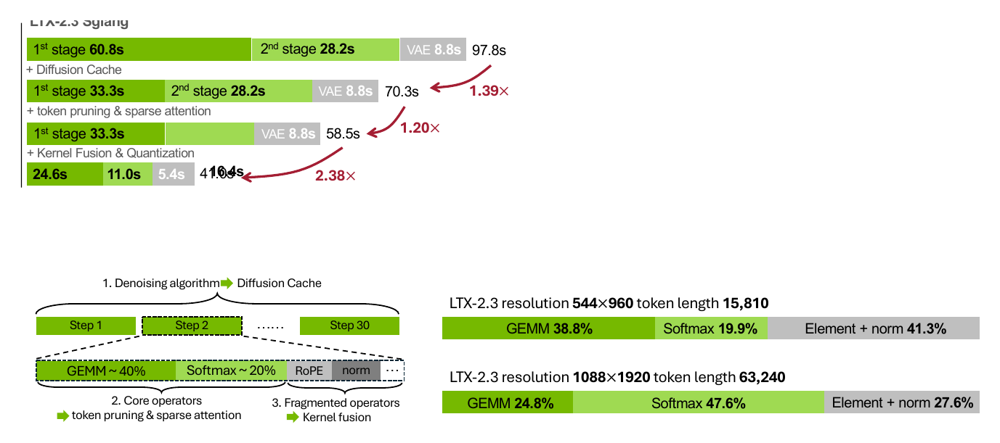

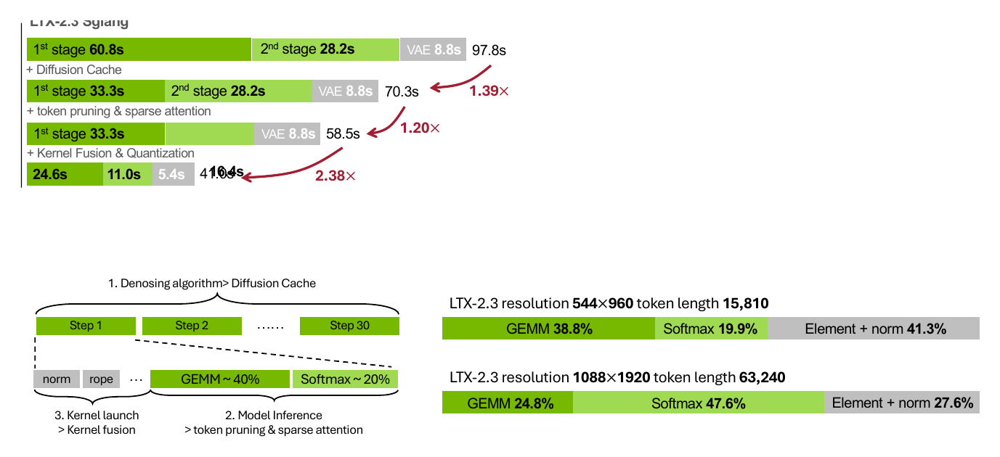

**图 2｜基线推理耗时构成与配置特定瓶颈。** 左：未加速服务路径中算法层、模型层与 kernel 层的冗余。右：同一模型与硬件下，不同扩散配置的时间剖析。空间分辨率改变主要瓶颈，因此也改变首要优化方向。

### 3.2 部署异构性：模型、硬件与配置

本文把加速目标定义为由三个同等重要的轴共同确定的异构部署实例：**模型、硬件和推理服务配置**。加速实现难以直接迁移，是因为每个实例同时受三者约束，并形成图 3 所示的大型组合空间。

- **模型** 决定数值与结构敏感性：不同骨干网络在量化鲁棒性、attention 冗余、跨去噪步 cache 稳定性以及 token 剪枝容忍度上不同。
- **硬件** 决定暴露何种瓶颈：在 B200 等高算力 GPU 上，大 GEMM 足够快，小算子 launch 与 memory-bound epilogue 可能占据更大比例；在较低算力 GPU 上，dense compute 仍占主导，同样的 launch 开销不明显。
- **配置** 包括空间/时间分辨率，例如 720p 与 1080p、24 fps 与 48 fps。分辨率提高会增加序列长度；attention 成本随 token 数近似二次增长，而 FFN/MLP 近似线性增长，所以 attention 与 FFN 的耗时比例会显著变化。

这些耦合约束使 cache、稀疏化、剪枝、融合和量化都具有实例特定性质。某个部署点上有效的方案，换到另一个点可能无法保持速度或质量。

这带来两点后果：

1. 部署实例太多，穷举式人工调优不可扩展。
2. 单个实例的目标（如延迟与质量保持）又十分明确，天然适合 agent 自动化。

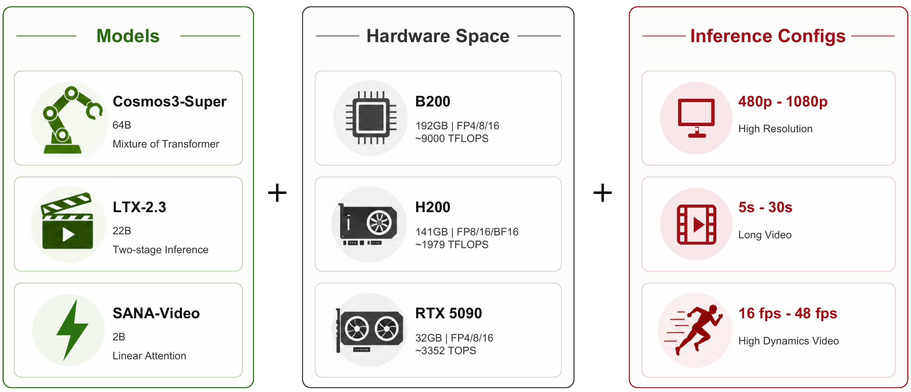

**图 3｜视频生成模型部署实例的联合组合空间。** 模型、硬件和推理配置共同定义大量部署实例。这种多样性使加速技术的实现成为持续性的工程问题，而非一次性优化。

## 4 智能体加速栈

Sol 构建了跨越三个层次的全栈加速框架：

- 算法层 cache 减少重复去噪步之间的冗余。
- 模型层稀疏注意力与 token 剪枝减少不必要的 token 计算。
- Kernel 层通过 kernel fusion 降低 launch 开销，并利用低精度硬件原语进行量化加速。

对于具体的“模型、硬件、服务配置”组合，框架在可接受生成质量约束下选择并组合最合适的技能子集。每项技术先局部调优，integrator 再组合各技术最优点并做全局调优。

最终在三个模型上实现约 2×-3× 端到端加速，收益来自全栈组合而不是单一方法。

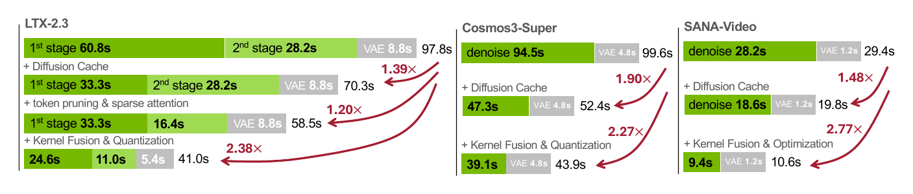

**图 4｜不同优化方法的累积加速拆解。** Cache、稀疏注意力与 token 剪枝、kernel 级优化依次降低端到端延迟；完整框架在 Cosmos3-Super、LTX-2.3 和 SANA-Video 上总体达到约 2×-3× 加速。

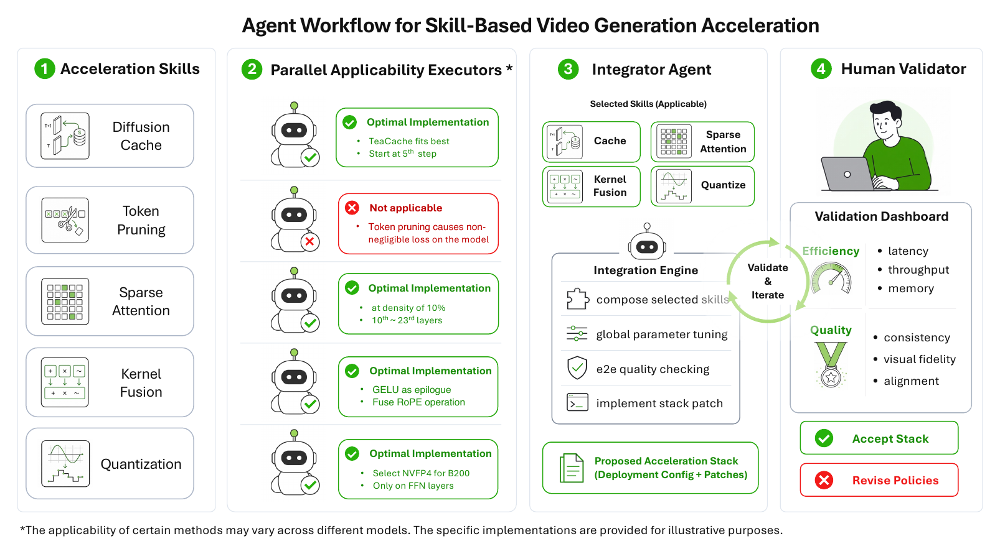

**图 5｜Agent-native 加速工作流。** 第一部分是按技术并行执行局部搜索，各 skill agent 独立探索候选；第二部分是全局集成与 human-validator 循环，integrator 将局部候选组合成完整加速栈，人类验证者反馈质量并指导下一轮。

### 4.1 Agent-native 加速工作流

该流程把下一节的技术族转化为结构化优化过程，分为三个阶段。

#### 并行 skill agent

每个技术族先独立做局部优化。直接让单一 agent 搜索整个联合空间成本高且速度慢，因此多个 agent 并行搜索各自空间。

例如：

- Cache agent 搜索跳步调度和补偿规则。
- Kernel-fusion agent 分析各 kernel 耗时，并测试 `GEMM + GELU`、`RoPE + norm` 等融合。

局部候选为后续全局优化提供高质量起点。

#### Agent integrator

Integrator 接收所有局部候选并构建目标部署的完整方案。方法并非相互独立，端到端加速不是局部收益的简单乘积；而且许多方法有损，直接叠加局部最优可能累积近似误差。

Integrator 因而执行真正的全局优化，判断：

- Cache 与稀疏注意力组合后是否仍可接受。
- 量化与 kernel fusion 在同一部署目标下是否兼容。

#### 人类验证者反馈

PSNR 等相似度指标与人类视觉感知不完全一致。细节轻微位移可能获得很差 PSNR，但人眼仍认为可接受；模糊、时间抖动或运动连贯性下降有时数值差异更小，却明显不可接受。

流程使用固定验证集检查每个集成候选，反馈下一轮能否更激进，还是应更保守地保持质量。

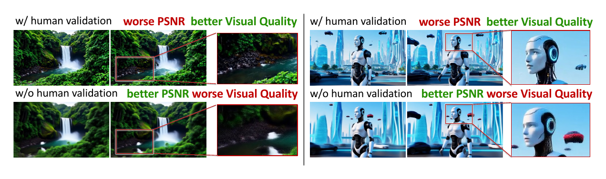

**图 6｜人类验证的必要性。** 人类验证者检查代表性生成结果并反馈整体视觉质量；PSNR 等传统相似度算子常无法真实反映面向部署的感知质量。

整体上，并行 agent 为每个技术族寻找强局部配置，integrator 搜索这些候选点的组合，人类验证者确认视觉质量，从而在无需大规模人工调优的情况下，为每个部署目标完成实例特定优化。

### 4.2 加速技术

#### 4.2.1 跨步缓存（Cross-Step Cache）

高质量扩散推理通常需要大量函数求值（NFE），常见为 30-50 个去噪步。模型在这些步骤间反复执行结构相似的计算，相邻状态也常产生相似中间特征。

跨步 cache 通过跳过选定去噪步的计算，并对被跳过的输出做补偿，利用轨迹层冗余。

- TeaCache 根据 timestep-conditioned 输入估计相邻时间步的输出变化，在预测变化较小时复用缓存残差 [12]。
- EasyCache 在线调整特征复用，以平衡加速与质量 [14]。
- TaylorSeer 用此前时间步特征的 Taylor 外推进行预测，在扩大 cache 间隔时减小质量下降 [13]。

Sol 不把某种 cache 当作通用解法，而是由 cache agent 针对实例选择策略，并调节跳步调度、缓存特征或残差、补偿规则、warmup 与最大连续缓存步数等参数。

#### 4.2.2 稀疏注意力（Sparse Attention）

长视频或高分辨率生成具有巨大的时空 token 集。相邻帧存在时间冗余，同一帧内存在空间冗余，因此给定步骤中许多 attention edge 对最终输出贡献很小。

稀疏注意力在不必改变外部 token lattice 的情况下，降低完整时空 attention 的二次复杂度。

- PISA 精确计算关键 block，并用一阶 Taylor 近似补偿非关键 block [17]。
- SpargeAttention 用 block-wise similarity 预测并跳过近零 attention 项 [21]。
- Sparse VideoGen 通过在线 profiling 与定制 kernel 利用时空稀疏模式 [18]。
- Sparse VideoGen2 用 semantic-aware permutation 改善稀疏 token 识别与 GPU layout [19]。

针对具体实例，sparse-attention agent 要选择合适后端、可安全稀疏化的层、稀疏模式与补偿策略，并验证速度-质量权衡。

#### 4.2.3 Token 剪枝

Token 剪枝通过跳过、合并或重建冗余 latent token 来缩短序列，降低后续 attention 与 FFN 的成本。

- ToMe-SD 证明可在推理期合并冗余 diffusion token，且质量损失有限 [27]。
- Astraea 在性能目标下搜索 video DiT 的 token budget [28]。
- TAPE 跨帧平滑 token 重要性以避免时间抖动 [29]。
- CoReDiT 按空间一致性剪枝，并重建被跳过的输出以保持 dense representation [30]。

Token-pruning agent 会调节剪枝准则、比例、层调度、时间步调度和重建规则，并在交给 integrator 前验证时间一致性与后期细节。

#### 4.2.4 量化

量化的实际加速高度受模型 hidden dimension、推理 token 数和硬件特性影响，质量损失又受训练后参数分布决定。因此不同部署实例的加速潜力和质量影响差异很大，必须逐实例搜索最佳速度-质量点。

- PTQ4DiT 指出显著通道与随时间步变化的激活是扩散模型后训练量化的关键挑战 [31]。
- Q-DiT 自动分配 DiT 量化粒度 [32]。
- SVDQuant 用低秩分量吸收权重和激活离群值，实现 4-bit 扩散推理 [34]。
- SageAttention 系列通过离群值平滑实现 8-bit 到 4-bit 的 attention 加速 [49-51]。

Sol 的 quantization agent 对层敏感性和 tensor shape 做 profiling，再调节逐层精度、权重/激活 bitwidth 与随时间步变化的 scaling，而不是全模型统一转低比特。

#### 4.2.5 Kernel Fusion

Transformer 和扩散骨干在 GEMM 周围反复执行 arithmetic intensity 很低的碎片算子，例如 bias addition、residual update、normalization、activation、scaling 与 layout conversion。

Kernel fusion 在中间结果仍位于寄存器或 shared memory 时执行这些 memory-bound 后继操作，避免物化到 HBM 并启动独立 kernel。

- CUTLASS epilogue 可把 GELU 等激活融合到 GEMM epilogue [36]。
- ByteTransformer 使用定制 CUTLASS epilogue 融合 bias 与 GELU，把访存延迟隐藏在 GEMM 内 [37]。
- CODA 将 Transformer block 重写为 GEMM-plus-epilogue 程序，把归一化、激活、残差、归约等融合进 tile-local epilogue [38]。

在 Sol 中，kernel-fusion agent 根据部分加速后的当前瓶颈做后期局部调优，选择要融合的算子序列、自定义 kernel 或编译器融合，并匹配当前 tensor shape 与精度格式。

## 5 实验

Sol 将 agent-native 流程应用到三个视频扩散模型。每个部署都是独立的“模型、硬件、推理服务配置”实例：共享同一技术栈，但具体实现必须按目标部署、优化并验证。

三个模型分别是 Cosmos3-Super（64B）[6]、LTX-2.3（22B）[8] 与 SANA-Video（2B）[11]。

### 5.1 实验协议

#### 部署硬件

所有主实验均使用 NVIDIA B200 GPU。作者首先在基于 SGLang 的 serving stack 中部署模型，再在其上开发加速组件。

- Cosmos3-Super 使用 4 张 GPU，并采用 sequence parallelism（SP）。
- LTX-2.3 与 SANA-Video 各使用 1 张 GPU。

#### 指标

主要指标是端到端延迟。质量保持使用 VBench [52]，在匹配的 prompt 与服务配置下评估视觉质量和运动质量。

#### 模型

- **Cosmos3-Super。** 面向物理生成的 64B 视频模型，采用 Mixture-of-Transformers（MoT）架构，包含自回归推理 tower 与扩散生成 tower。
- **LTX-2.3。** 22B 音视频扩散模型。服务管线分两阶段：阶段 1 在 $544 \times 960$ 下用 15 个去噪步生成 latent；阶段 2 在 $1088 \times 1920$ 下上采样并用 3 步细化，随后 VAE 解码 241 帧。高质量管线使用二阶 `res_2s` sampler，与许多 cache heuristic 假设的 Euler-style schedule 不同。
- **SANA-Video。** 基于 block linear diffusion transformer 的 2B 模型，用线性注意力降低标准注意力 $O(n^2)$ 开销，并用卷积增强 FFN 保留局部时空结构。

### 5.2 效率分析

尽管三种部署的模型架构、参数规模和推理管线差异显著，Sol 均达到超过 2× 的端到端加速，说明框架并不绑定某一种骨干网络。

表 1 以 SGLang 为 1.00×，同时列出官方管线延迟。

| 框架 | Cosmos3-Super 延迟 | 加速 | LTX-2.3 延迟 | 加速 | SANA-Video 延迟 | 加速 |
|---|---:|---:|---:|---:|---:|---:|
| 官方 | 108.3 s | - | 118.1 s | - | 34.2 s | - |
| SGLang | 99.6 s | 1.00× | 97.8 s | 1.00× | 29.4 s | 1.00× |
| **Sol-Engine** | ** 43.9 s** | ** 2.27×** | ** 41.0 s** | ** 2.38×** | ** 10.6 s** | ** 2.77×** |

**表 1｜NVIDIA B200 上各模型部署的端到端加速。** 完整优化后的系统取得约 2×-3× 端到端加速。

#### Cosmos3-Super

官方管线为 108.3 s，SGLang 为 99.6 s。Cache agent 为 64B MoT 选择 TeaCache 风格策略，将延迟降至 52.4 s（相对 SGLang 1.90×）。

量化按去噪时间选择：早期低精度可能造成更大结构偏差，最后细化步低精度可能产生高频伪影，因此 agent 按时间步和模块敏感性分配精度。

再经 kernel 级优化，延迟降至 43.9 s，相对 SGLang 累积加速 2.27×，相对官方管线为 2.47×。

#### LTX-2.3

官方管线为 118.1 s，SGLang 为 97.8 s。由于高质量管线使用 `res_2s` sampler，针对 Euler 调优的 cache 调度不适配。

Agent 找到固定步跳过策略，在同一 NFE 预算下降至 70.3 s（1.39×）。稀疏注意力和 token 剪枝作用于高分辨率阶段，降至 58.5 s（增量 1.20×、累积 1.67×）。

随后把 GELU 等 memory-bound 碎片算子融合为线性层 epilogue，并结合 NVFP4 量化，最终降至 41.0 s，相对 SGLang 为 2.38×、相对官方为 2.88×。

#### SANA-Video

官方管线为 34.2 s，SGLang 为 29.4 s。模型本身已采用线性注意力，模型层加速空间较小，因此重点优化扩散算法层与 kernel 层。

Cache agent 选择 EasyCache，将延迟降至 19.8 s（1.48×）。低比特线性注意力 kernel 额外带来约 1.2× kernel 级加速，重建损失很小（PSNR 高于 30 dB）。

`torch.compile` 通过算子融合与图构建降低 launch 开销，最终达到 10.6 s，相对 SGLang 为 2.77×、相对官方为 3.23×。

### 5.3 质量评估

表 2 使用细分 VBench 维度比较未加速 baseline 与完整全栈管线。加速栈的平均评分与 baseline 基本持平，只在视觉与运动质量上产生很小波动。

这说明延迟收益主要来自消除冗余或低效操作，而不是牺牲感知上关键的计算。

| 配置 | 平均分 | 主体一致 | 背景一致 | 时域闪烁 | 运动平滑 | 美学质量 | 成像质量 | 整体一致 |
|---|---:|---:|---:|---:|---:|---:|---:|---:|
| Cosmos Baseline | 0.7759 | 0.9687 | 0.9301 | 0.9859 | 0.9923 | 0.6134 | 0.7276 | 0.2133 |
| Cosmos Sol | 0.7775 | 0.9723 | 0.9382 | 0.9877 | 0.9935 | 0.6197 | 0.7178 | 0.2133 |
| Cosmos Δ | +0.21% | +0.37% | +0.87% | +0.18% | +0.12% | +1.03% | -1.35% | 0.00% |
| LTX Baseline | 0.7646 | 0.9010 | 0.9245 | 0.9675 | 0.9871 | 0.6234 | 0.7012 | 0.2474 |
| LTX Sol | 0.7605 | 0.9006 | 0.9137 | 0.9704 | 0.9840 | 0.6104 | 0.7013 | 0.2429 |
| LTX Δ | -0.54% | -0.04% | -1.17% | +0.30% | -0.31% | -2.09% | +0.01% | -1.82% |
| SANA Baseline | 0.7864 | 0.9730 | 0.9648 | 0.9626 | 0.9843 | 0.6650 | 0.6892 | 0.2660 |
| SANA Sol | 0.7847 | 0.9750 | 0.9654 | 0.9646 | 0.9842 | 0.6624 | 0.6779 | 0.2637 |
| SANA Δ | -0.21% | +0.21% | +0.06% | +0.21% | -0.01% | -0.39% | -1.64% | -0.86% |

**表 2｜全栈加速下的 VBench 质量评估。** Δ 为相对 baseline 的百分比变化。

在相同 prompt 与服务配置下，加速输出的细微视觉细节可能不同，但整体视觉质量、运动质量和物理保真度仍然很高；场景布局、主体安排与运动结构均得到保留，满足近无损服务部署的关键要求。

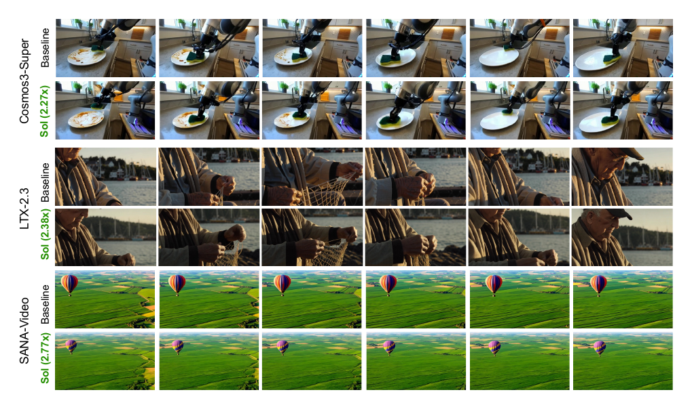

**图 7｜生成视频的视觉对比。** 在匹配的 prompt 与服务配置下比较未加速与加速输出，并标注延迟。框架取得显著加速，同时未引入肉眼明显可感知的质量差异。

### 5.4 扩展到 NVIDIA B300

作者进一步比较单卡 B200 与 B300 上的 Cosmos3-Super。B300 相比 B200 的 BF16 能力相近，但 NVFP4 算力更高 [53]。

因此，较少依赖 NVFP4 的 LTX-2.3 与 SANA-Video 在单卡设置下端到端变化不明显；更依赖 NVFP4 的 Cosmos3-Super 在 B300 上收益更清楚。

| 框架 | 延迟 | 相对同卡 baseline 加速 |
|---|---:|---:|
| B200 × SGLang | 353.5 s | 1.00× |
| **B200 × Sol-Engine** | ** 143.8 s** | ** 2.46×** |
| B300 × SGLang | 351.9 s | 1.00× |
| **B300 × Sol-Engine** | ** 137.6 s** | ** 2.56×** |

**表 3｜B200 与 B300 上的单卡 Cosmos3-Super。** 加速比均相对同一硬件上的 baseline 归一化，采用 NVFP4 栈时 B300 优势更明显。

## 6 结论

现代大规模视频扩散模型的质量迅速提升，但推理成本仍是实际部署的主要障碍。本文认为核心系统挑战是**实例特定加速**：有效收益共同取决于模型架构、推理服务配置和硬件平台；针对一个部署实例调优的方案经常无法迁移到另一个实例。

这些因素形成庞大的优化空间，为每个实例人工开发独立方案需要大量工程投入。

Sol 用智能体加速栈与 agent-native 工作流解决这一问题。技术栈把 cache、量化、高效稀疏注意力、token 剪枝和 kernel 优化组织成模型特定设计空间；并行 skill agent 调优局部候选，integrator 把候选组成部署栈，人类验证者反馈最终效率-质量权衡。

在三个模型上，Sol 跨不同规模与架构均实现超过 2× 的端到端加速，同时视觉与运动质量只有可忽略的下降。

### 局限与未来工作

当前流程仍依赖人类对最终质量做判断。PSNR 一类自动损失或相似度指标与视频生成的视觉意图并不一致：

- 无害细节变化可能造成大数值差异。
- 高频噪声、模糊、时间抖动或不符合物理规律的运动可能在数值上接近 baseline，却在人眼看来不可接受。

因此系统保留 human-in-the-loop，让人检查代表性生成、更新可接受质量边界，并在自动评分遗漏可见伪影时重定向 agent 搜索。

未来可引入更强的端到端视觉质量评估器，以减少人工验证、扩展反馈循环，并让 agent 在质量约束内做更激进的优化。可能的组件包括：

- 学习式视频偏好模型。
- 伪影检测器。
- 物理一致性检查。
- 基于 VLM 的端到端质量判断。

---

## 附录 A 实现细节

### A.1 总体实现细节

三个模型仅在具体实现范围和超参数上不同：

- Cache 策略。
- 稀疏注意力替换。
- Token 剪枝调度。
- 低精度量化范围。
- Kernel fusion。

部署接口始终分为 dense `baseline` 路径与组合后的 `fullopt` 路径，因此比较反映端到端 serving stack，而不是孤立的 kernel microbenchmark。

运行时仍基于 SGLang；优化路径根据各模型架构与瓶颈，选择性替换为 cache 复用、稀疏或减少 token 的计算、低精度 kernel 与融合算子序列。

全局原则保持一致：

- Cache 始终是无需训练的去噪步复用策略，但调度随模型变化。
- 只有 attention map 具有足够结构时，才用分段稀疏模式替换 dense bidirectional attention。
- 只有中间视频 token 冗余足够时才剪枝。
- 量化按区域选择，数值脆弱阶段保留高精度，稳定且 GEMM 密集的区域转低精度。
- Kernel 优化也按 workload 选择 epilogue fusion、QKV 路径融合、normalization 路径融合与编译器图融合。

### A.2 模型特定管线

#### A.2.1 Cosmos3-Super

Cosmos3-Super 主要由超大 Transformer block 主导，因此优化重点是减少重复去噪计算，并加速轨迹中段 GEMM 密集区域。

Cache 采用 TeaCache 风格残差回放：

- 阈值：1.15。
- 起始步：10。
- 最多连续命中：3 次。

它测量相邻去噪步生成 hidden state 的相对 $L_1$ 变化并累积；仅当累积变化低于阈值时跳过 generation-path Transformer block，否则重新计算并刷新缓存残差。

量化不统一施加，而是按步骤选择。前 3 个和后 3 个去噪步保留 dense/high-precision 路径：早期决定全局结构，后期细化高频细节。

NVFP4 用于更规律的中间步骤和算术密度高的 generation-path 线性层，包括：

- FFN gate-up projection。
- FFN down projection。
- Attention QKV projection。
- Attention output projection。

因此 Cosmos3-Super 是 cache 与 NVFP4 Transformer 执行带来端到端收益最明显的案例。

#### A.2.2 LTX-2.3

LTX-2.3 采用两阶段高质量管线：

- 阶段 1：在 $544 \times 960$ 上用 `res_2s` sampler 运行 15 个去噪步。
- 阶段 2：在 $1088 \times 1920$ 上对 latent 上采样并细化 3 步，随后 VAE 解码 241 帧。

`fullopt` 在阶段 1 使用固定步 cache，而不是在线 TeaCache 阈值。预设为 `8of15_last_29calls`：在 29 次阶段 1 denoiser 调用中，于索引

```text
[13, 14, 16, 17, 18, 19, 20, 21, 22, 24, 25, 26, 27]
```

复用上次结果，并设置：

```text
reuse_mode=last
max_skip_steps=30
```

阶段 2 仅在高分辨率 refinement Transformer 上使用 PISA：

- 稀疏率：0.9，density 为 0.1。
- Block size：64。
- 只替换视频 self-attention。
- 阶段 1 的稀疏调度关闭。
- 阶段 2 的第 0-1 层保持 dense。
- 后续层采用 piecewise attention、approximate remainder、score-based routing 与 FlashAttention dense fallback。

Token 剪枝也只用于阶段 2：根据 `feat_norm` 显著性保留 50% 视频 token，并应用于第 1、2 次 refinement 调用。

NVFP4 仅用于视频 FFN 输入/输出 projection；NVFP4 fused `proj_in+GELU` 与 `proj_out+bias+gate` 路径关闭。

完整栈开启的 lossless fusion 包括：

- Block-0 self-attention sharing。
- Guidance-prefix sharing。
- Fused QK+RoPE。
- Fused RMS-AdaLN。
- Fused AdaLN。
- Fused QKNorm+RoPE。
- Fused dual modulation。
- Fused cross-attention dual modulation。
- Fused Ada values。
- Fused residual gate。
- Fused FFN `proj_in+GELU`。
- Compiled gate-to-output。
- Fused audio QKVG。
- Global fused QKNorm+RoPE。
- Compiled tiled VAE decoding。

Distilled LoRA strength 在阶段 1 为 0.25、阶段 2 为 0.5；阶段 2 的 sigmas 为：

```text
[0.909375, 0.725, 0.421875, 0.0]
```

#### A.2.3 SANA-Video

SANA-Video 使用 2B 线性注意力骨干，主 demo 配置为：

- 81 帧。
- 50 个去噪步。
- 480p，分辨率 $832 \times 480$。

优化路径不使用稀疏注意力、token 剪枝或 NVFP4 FFN 量化。

Cache 使用 EasyCache：

- 阈值：0.1。
- Warmup：3 步。
- 空间 subsample stride：8。

决策规则根据下采样 hidden state 在线估计输入到输出的变化率，并累积相对输出变化；累积值低于阈值时跳过 Transformer block stack。缓存残差在未 batch 的 CFG 分支间共享，以避免注入过期 guidance。

其余加速来自三个无损或近无损 kernel 路径改动：

1. 线性注意力 K/V aggregation 保持 BF16 Tensor Core 执行，不提升到 FP32。
2. 加载权重后拼接 projection weight，把 self-attention Q/K/V projection 合为单次 GEMM。
3. 用 `torch.compile` 编译 DiT block stack。

Max-autotune 使用：

```text
max-autotune-no-cudagraphs
subprocess autotuning
persistent TorchInductor cache
```

安全路径使用默认 `torch.compile` 模式。480p 设置下，EasyCache 在 50 步中约跳过 16 步，剩余收益来自 BF16 线性注意力、QKV merge 与 compile/fusion。

## 附录 B 扩展视觉对比

作者为 Cosmos3-Super、LTX-2.3 与 SANA-Video 各收集 6 组匹配视频。每幅图上方是未加速 SGLang 结果，下方是相同 prompt 的 Sol-Engine 结果，用于检查加速后是否保持场景布局、运动演化与视觉保真度。

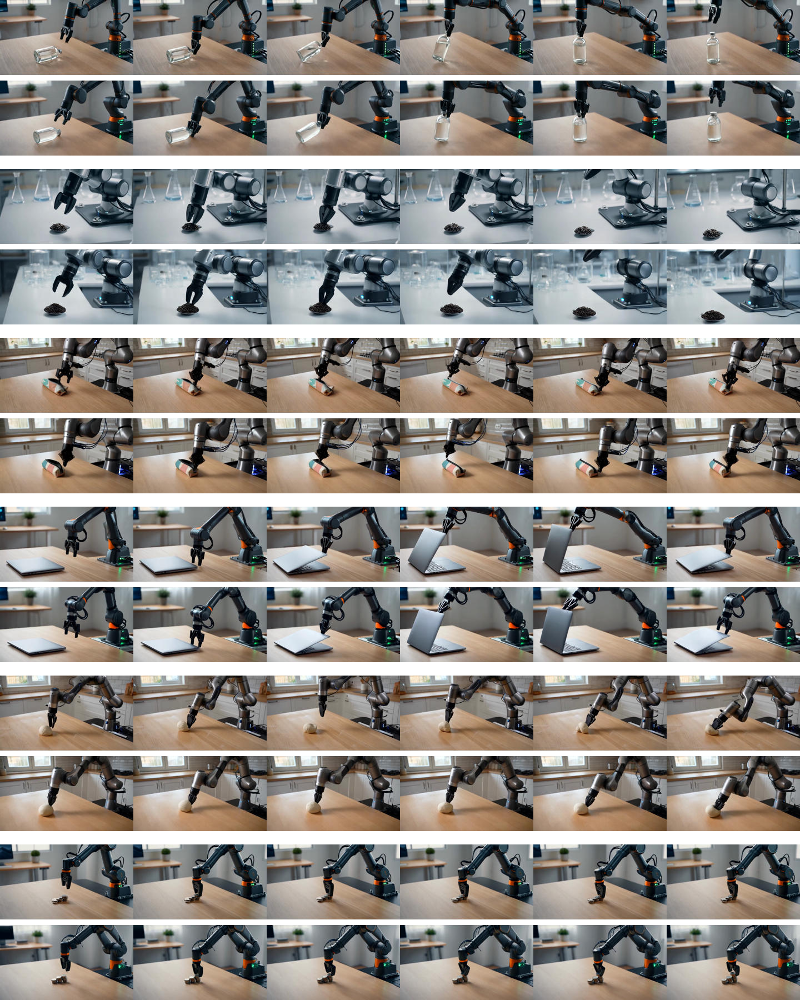

**图 8｜Cosmos3-Super 扩展视觉对比。** 上：SGLang；下：Sol-Engine。相对 SGLang 达到 2.27× 端到端加速，同时保持主要场景布局、物体结构与运动演化。

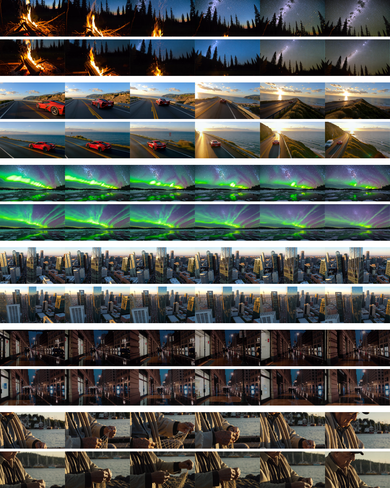

**图 9｜LTX-2.3 扩展视觉对比。** 上：SGLang；下：Sol-Engine。相对 SGLang 达到 2.38× 加速，同时保持整体视觉质量、时间一致性与场景构图。

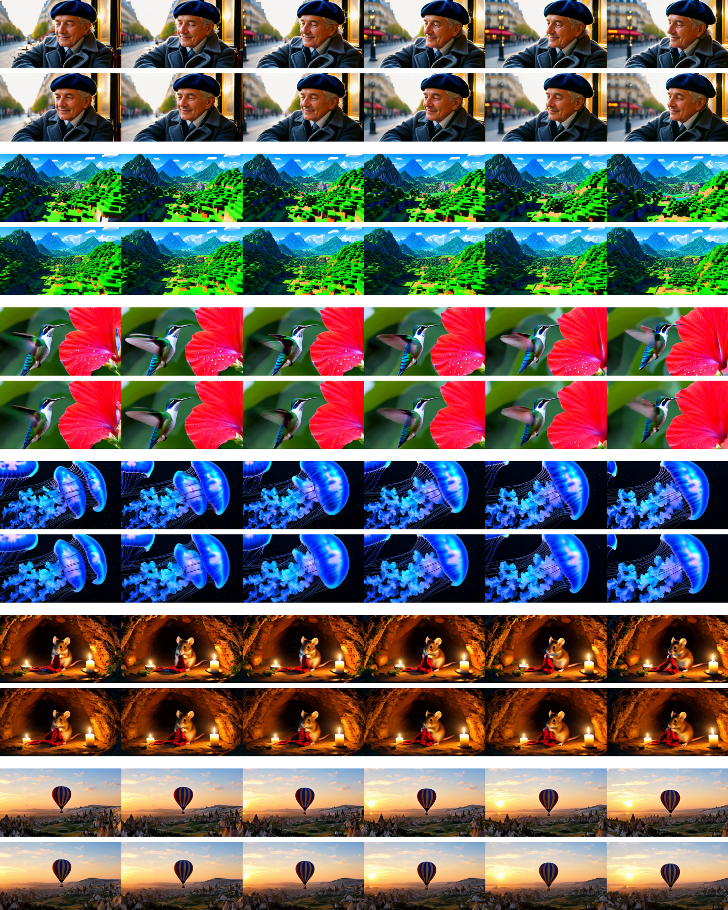

**图 10｜SANA-Video 扩展视觉对比。** 上：SGLang；下：Sol-Engine。相对 SGLang 达到 2.77× 加速，同时保持 prompt 层面的外观、运动趋势与感知质量。

---

## 参考文献

参考文献保留英文题名与出版信息，便于检索；编号与原论文一致。

1. Wenyi Hong, Ming Ding, Wendi Zheng, Xinghan Liu, and Jie Tang. *CogVideo: Large-scale pretraining for text-to-video generation via transformers*. arXiv:2205.15868, 2022.
2. Zhuoyi Yang, Jiayan Teng, Wendi Zheng, et al. *CogVideoX: Text-to-video diffusion models with an expert transformer*. ICLR, 2025.
3. Team Wan, Ang Wang, Baole Ai, et al. *Wan: Open and advanced large-scale video generative models*. arXiv:2503.20314, 2025.
4. Weijie Kong, Qi Tian, Zijian Zhang, et al. *HunyuanVideo: A systematic framework for large video generative models*. arXiv:2412.03603, 2024.
5. Tencent Hunyuan Foundation Model Team. *HunyuanVideo 1.5 Technical Report*. 2025. https://arxiv.org/abs/2511.18870
6. NVIDIA. *Cosmos 3: Omnimodal world models for physical AI*. arXiv:2606.02800, 2026.
7. Meituan LongCat Team, Xunliang Cai, Qilong Huang, et al. *LongCat-Video Technical Report*. 2025. https://arxiv.org/abs/2510.22200
8. Lightricks. *LTX-2.3 Model Card*. 2026. https://huggingface.co/Lightricks/LTX-2.3
9. Echo Team @ Joy Future Academy, JD. *JoyAI-Echo: Pushing the frontier of long video generation*. Technical report, 2026.
10. Yang Jin, Zhicheng Sun, Ningyuan Li, et al. *Pyramidal flow matching for efficient video generative modeling*. arXiv:2410.05954, 2024.
11. Junsong Chen, Yuyang Zhao, Jincheng Yu, et al. *SANA-Video: Efficient video generation with block linear diffusion transformer*. arXiv:2509.24695, 2025.
12. Feng Liu, Shiwei Zhang, Xiaofeng Wang, et al. *Timestep embedding tells: It’s time to cache for video diffusion model*. arXiv:2411.19108, 2024.
13. Jiacheng Liu, Chang Zou, Yuanhuiyi Lyu, Junjie Chen, and Linfeng Zhang. *From reusing to forecasting: Accelerating diffusion models with TaylorSeers*. ICCV, 2025.
14. Xin Zhou, Dingkang Liang, Kaijin Chen, et al. *Less is enough: Training-free video diffusion acceleration via runtime-adaptive caching*. arXiv:2507.02860, 2025.
15. DefTruth, vipshop.com, et al. *Cache-DiT: A PyTorch-native inference engine with cache, parallelism and quantization for diffusion transformers*. 2025. https://github.com/vipshop/cache-dit
16. Xuanlei Zhao, Xiaolong Jin, Kai Wang, and Yang You. *Real-time video generation with pyramid attention broadcast*. arXiv:2408.12588, 2024.
17. Haopeng Li, Shitong Shao, Wenliang Zhong, et al. *PISA: Piecewise sparse attention is wiser for efficient diffusion transformers*. arXiv:2602.01077, 2026.
18. Haocheng Xi, Shuo Yang, Yilong Zhao, et al. *Sparse VideoGen: Accelerating video diffusion transformers with spatial-temporal sparsity*. arXiv:2502.01776, 2025.
19. Shuo Yang, Haocheng Xi, Yilong Zhao, et al. *Sparse VideoGen2: Accelerate video generation with sparse attention via semantic-aware permutation*. arXiv:2505.18875, 2025.
20. Peiyuan Zhang, Yongqi Chen, Haofeng Huang, et al. *Faster video diffusion with trainable sparse attention*. NeurIPS, 2025.
21. Jintao Zhang, Chendong Xiang, Haofeng Huang, et al. *SpargeAttn: Accurate sparse attention accelerating any model inference*. ICML, 2025.
22. Xuan Shen, Chenxia Han, Yufa Zhou, et al. *DraftAttention: Fast video diffusion via low-resolution attention guidance*. arXiv:2505.14708, 2025.
23. Peiyuan Zhang, Yongqi Chen, Runlong Su, et al. *Fast video generation with sliding tile attention*. ICML, 2025.
24. Ruyi Xu, Guangxuan Xiao, Haofeng Huang, Junxian Guo, and Song Han. *XAttention: Block sparse attention with antidiagonal scoring*. ICML, 2025.
25. Xingyang Li, Muyang Li, Tianle Cai, et al. *Radial attention: $O(n \log n)$ sparse attention with energy decay for long video generation*. arXiv:2506.19852, 2025.
26. Yukang Chen, Luozhou Wang, Wei Huang, et al. *LongLive-2.0: An NVFP4 parallel infrastructure for long video generation*. arXiv:2605.18739, 2026.
27. Daniel Bolya and Judy Hoffman. *Token merging for fast Stable Diffusion*. CVPR Workshop on Efficient Deep Learning for Computer Vision, 2023.
28. Haosong Liu, Yuge Cheng, Wenxuan Miao, et al. *Astraea: A token-wise acceleration framework for video diffusion transformers*. arXiv:2506.05096, 2025.
29. Sheng Li, Yang Sui, Junhao Ran, et al. *Temporal aware pruning for efficient diffusion-based video generation*. arXiv:2605.17837, 2026.
30. Zhuojin Li, Hsin-Pai Cheng, Hong Cai, et al. *CoReDiT: Spatial coherence-guided token pruning and reconstruction for efficient diffusion transformers*. arXiv:2605.14191, 2026.
31. Junyi Wu, Haoxuan Wang, Yuzhang Shang, Mubarak Shah, and Yan Yan. *PTQ4DiT: Post-training quantization for diffusion transformers*. NeurIPS, 2024.
32. Lei Chen, Yuan Meng, Chen Tang, et al. *Q-DiT: Accurate post-training quantization for diffusion transformers*. CVPR, 2025.
33. Tianchen Zhao, Tongcheng Fang, Haofeng Huang, et al. *ViDiT-Q: Efficient and accurate quantization of diffusion transformers for image and video generation*. ICLR, 2025.
34. Muyang Li, Yujun Lin, Zhekai Zhang, et al. *SVDQuant: Absorbing outliers by low-rank component for 4-bit diffusion models*. ICLR, 2025.
35. Yitong Li, Junsong Chen, Shuchen Xue, et al. *FP4 explore, BF16 train: Diffusion reinforcement learning via efficient rollout scaling*. arXiv:2604.06916, 2026.
36. NVIDIA. *CUTLASS Epilogue Operations*. 2025. https://nvidia-cutlass-22.mintlify.app/cpp/epilogue
37. Yujia Zhai, Chengquan Jiang, Leyuan Wang, et al. *ByteTransformer: A high-performance transformer boosted for variable-length inputs*. IPDPS, 2023.
38. Han Guo, Jack Zhang, Arjun Menon, et al. *CODA: Rewriting transformer blocks as GEMM-epilogue programs*. arXiv:2605.19269, 2026.
39. Xiao Liu, Hao Yu, Hanchen Zhang, et al. *AgentBench: Evaluating LLMs as agents*. ICLR, 2024.
40. Qian Huang, Jian Vora, Percy Liang, and Jure Leskovec. *MLAgentBench: Evaluating language agents on machine learning experimentation*. ICML, 2024.
41. John Yang, Carlos E. Jimenez, Alexander Wettig, et al. *SWE-agent: Agent-computer interfaces enable automated software engineering*. NeurIPS, 2024.
42. Yuntong Zhang, Haifeng Ruan, Zhiyu Fan, and Abhik Roychoudhury. *AutoCodeRover: Autonomous program improvement*. arXiv:2404.05427, 2024.
43. Chunqiu Steven Xia, Yinlin Deng, Soren Dunn, and Lingming Zhang. *Agentless: Demystifying LLM-based software engineering agents*. arXiv:2407.01489, 2024.
44. Xingyao Wang, Boxuan Li, Yufan Song, et al. *OpenHands: An open platform for AI software developers as generalist agents*. arXiv:2407.16741, 2024.
45. Hailin Zhong and Shengxin Zhu. *AI harness engineering: A runtime substrate for foundation-model software agents*. arXiv:2605.13357, 2026.
46. Chris Lu, Cong Lu, Robert Tjarko Lange, et al. *The AI Scientist: Towards fully automated open-ended scientific discovery*. arXiv:2408.06292, 2024.
47. Wentao Chen, Jiace Zhu, Qi Fan, Yehan Ma, and An Zou. *CUDA-LLM: LLMs can write efficient CUDA kernels*. arXiv:2506.09092, 2025.
48. Zijian Zhang, Rong Wang, Shiyang Li, et al. *CudaForge: An agent framework with hardware feedback for CUDA kernel optimization*. arXiv:2511.01884, 2025.
49. Jintao Zhang, Jia Wei, Haofeng Huang, et al. *SageAttention: Accurate 8-bit attention for plug-and-play inference acceleration*. ICLR, 2025.
50. Jintao Zhang, Haofeng Huang, Pengle Zhang, et al. *SageAttention2: Efficient attention with thorough outlier smoothing and per-thread INT4 quantization*. ICML, 2025.
51. Jintao Zhang, Jia Wei, Haoxu Wang, et al. *SageAttention3: Microscaling FP4 attention for inference and an exploration of 8-bit training*. arXiv:2505.11594, 2025.
52. Ziqi Huang, Yinan He, Jiashuo Yu, et al. *VBench: Comprehensive benchmark suite for video generative models*. CVPR, 2024.
53. NVIDIA. *Components - NVIDIA HGX AI Factory*. 2026. https://docs.nvidia.com/enterprise-reference-architectures/hgx-ai-factory/latest/components.html

---

> [!note] 译者说明
> 本文依据 arXiv:2606.23743v2 的 LaTeX 源码与官方 PDF 重排。模型名、方法名、API、数值格式、变量、代码配置、图内标注及参考文献题名保留英文；正文与图表说明译为中文。如需引用研究结论或复现实验，请以英文原论文及作者公开代码为准。
